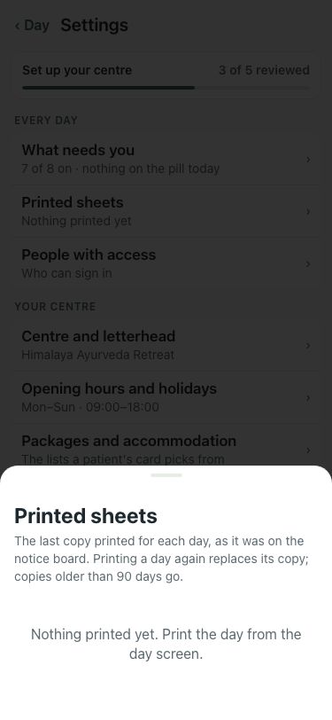

# UAT 2026-10-08-488-before

Base http://localhost:8150, 375x812. Written by scripts/uat.mjs.

| # | Step | Result | Read off the page | Shot |
|---|---|---|---|---|
| 01 | Printed sheets starts with Records for a month | FAIL | TimeoutError: locator.selectOption: Timeout 30000ms exceeded. Call log:   - waiting for getByRole('dialog').last().getByLabel('Records for a month') |  |
