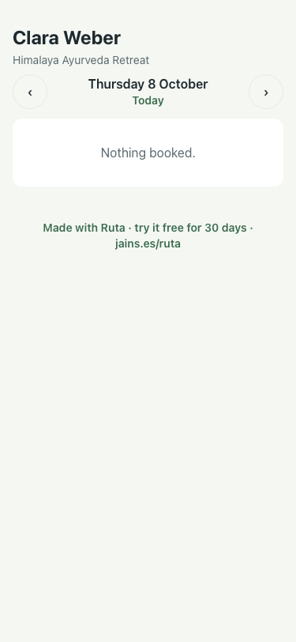

# UAT 2026-10-08-489-before

Base http://localhost:8150, 375x812. Written by scripts/uat.mjs.

| # | Step | Result | Read off the page | Shot |
|---|---|---|---|---|
| 01 | The link asks for their details | FAIL |  |  |
| 02 | They fill them and the card has them | FAIL | TimeoutError: locator.click: Timeout 5000ms exceeded. Call log:   - waiting for getByText('Your details').first() |  |
