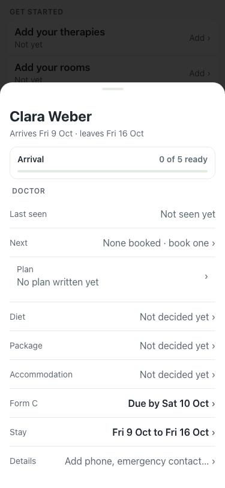
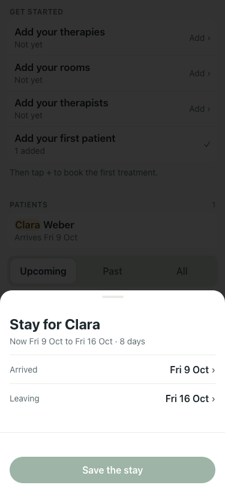

# UAT 2026-10-08-495-after

Base http://localhost:8141, 375x812. Written by scripts/uat.mjs.

| # | Step | Result | Read off the page | Shot |
|---|---|---|---|---|
| 01 | Their card says when they arrive, and the Arrival checklist is there | pass | Arrives Fri 9 Oct · leaves Fri 16 Oct · Arrival · 0 of 5 ready · Stay · Fri 9 Oct to Fri 16 Oct |  |
| 02 | Stay opens the stay they have, not a new one | pass | Stay for Clara · Now Fri 9 Oct to Fri 16 Oct · 8 days · Arrived · Fri 9 Oct |  |
