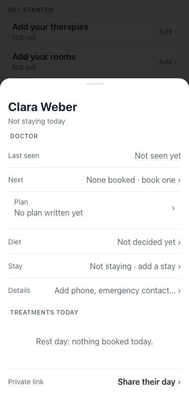
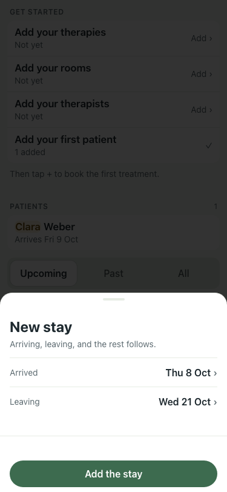

# UAT 2026-10-08-495-before

Base http://localhost:8140, 375x812. Written by scripts/uat.mjs.

| # | Step | Result | Read off the page | Shot |
|---|---|---|---|---|
| 01 | Their card says when they arrive, and the Arrival checklist is there | FAIL | Stay |  |
| 02 | Stay opens the stay they have, not a new one | FAIL | New stay · Arriving, leaving, and the rest follows. · Arrived · Thu 8 Oct |  |
