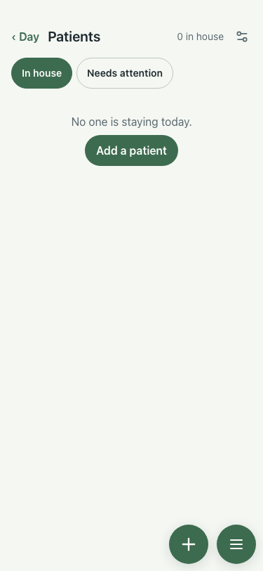

# UAT 2026-10-08-496-before

Base http://localhost:8140, 375x812. Written by scripts/uat.mjs.

| # | Step | Result | Read off the page | Shot |
|---|---|---|---|---|
| 01 | Patients lists the guests arriving in the next two weeks | FAIL | No one is staying today. |  |
| 02 | Tapping one opens their card | FAIL | TimeoutError: locator.click: Timeout 5000ms exceeded. Call log:   - waiting for getByRole('button', { name: /^Clara Weber/ }).first() |  |
