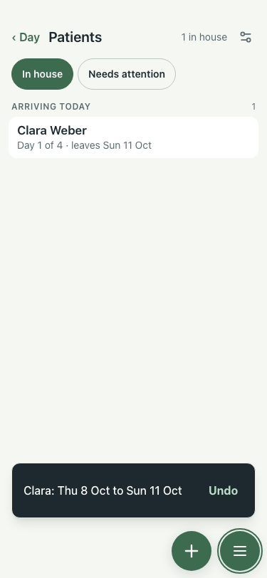

# UAT 2026-10-08-500-after

Base http://localhost:8147, 375x812. Written by scripts/uat.mjs.

| # | Step | Result | Read off the page | Shot |
|---|---|---|---|---|
| 01 | Discharge: a dated follow-up is not missing, and one (optional) | pass | missing: 7 / Address / Add › / Country · Total payment (optional) |  |
| 02 | The list behind the card follows a changed stay | pass | Day 1 of 4 · leaves Sun 11 Oct |  |
