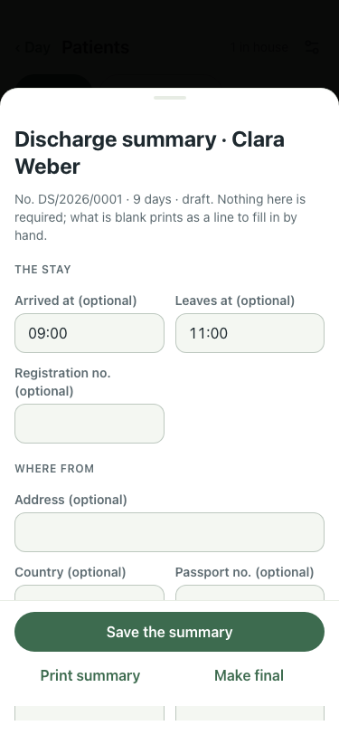
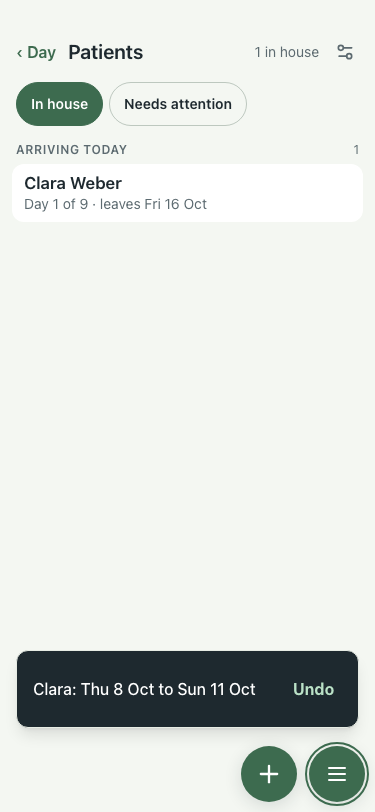

# UAT 2026-10-08-500-before

Base http://localhost:8140, 375x812. Written by scripts/uat.mjs.

| # | Step | Result | Read off the page | Shot |
|---|---|---|---|---|
| 01 | Discharge: a dated follow-up is not missing, and one (optional) | FAIL | missing: 8 / Address / Add › / Country · Total payment (optional) (optional) |  |
| 02 | The list behind the card follows a changed stay | FAIL | Day 1 of 9 · leaves Fri 16 Oct |  |
