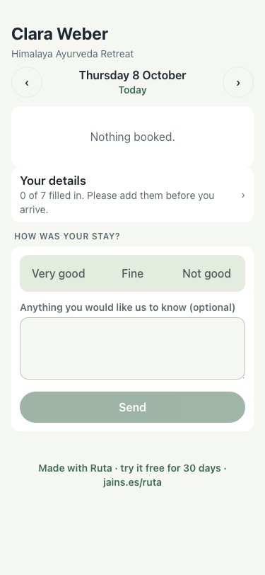
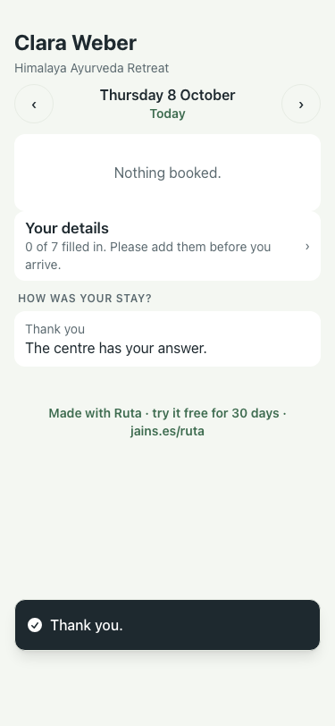
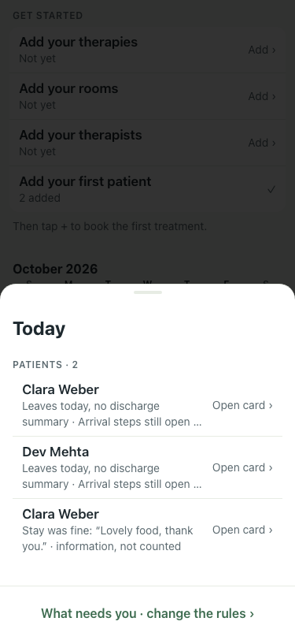
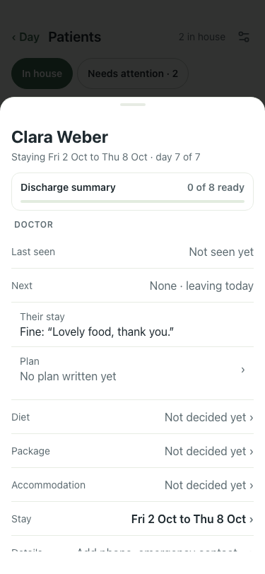

# UAT 2026-10-08-509-after

Base http://localhost:8149, 375x812. Written by scripts/uat.mjs.

| # | Step | Result | Read off the page | Shot |
|---|---|---|---|---|
| 01 | The guest is asked how the stay was | pass | HOW WAS YOUR STAY? · Very good · Fine · Not good · Send |  |
| 02 | They answer, and are thanked | pass | Thank you. · Thank you · The centre has your answer. |  |
| 03 | Not good raises the pill; fine and good stay in grey | pass | Leaves today, no discharge summary · Arrival steps still open · No diet plan · Stay was not good: “The room was cold.” · Stay was fine: “Lovely food, thank you.” · information, not counted · What needs you · change the rules › |  |
| 04 | The card says what they said | pass | Their stay · Fine: “Lovely food, thank you.” |  |
