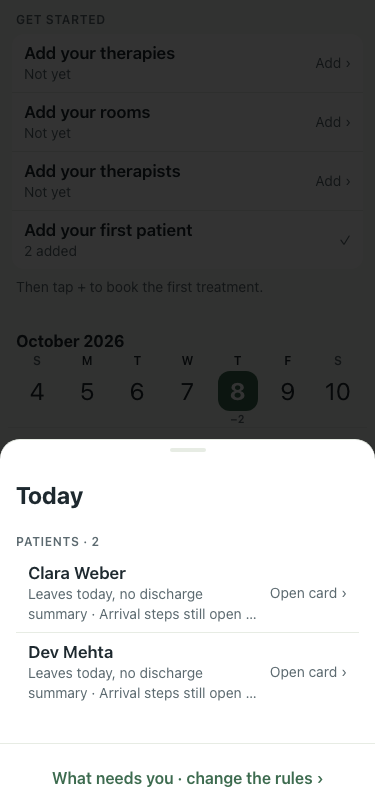
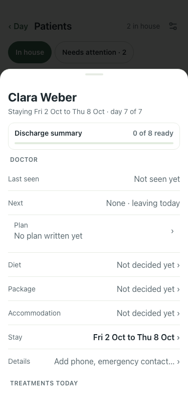

# UAT 2026-10-08-509-before

Base http://localhost:8140, 375x812. Written by scripts/uat.mjs.

| # | Step | Result | Read off the page | Shot |
|---|---|---|---|---|
| 01 | The guest is asked how the stay was | FAIL |  |  |
| 02 | They answer, and are thanked | FAIL | TimeoutError: locator.click: Timeout 5000ms exceeded. Call log:   - waiting for getByRole('button', { name: 'Fine' }) |  |
| 03 | Not good raises the pill; fine and good stay in grey | FAIL | What needs you · change the rules › |  |
| 04 | The card says what they said | FAIL |  |  |
