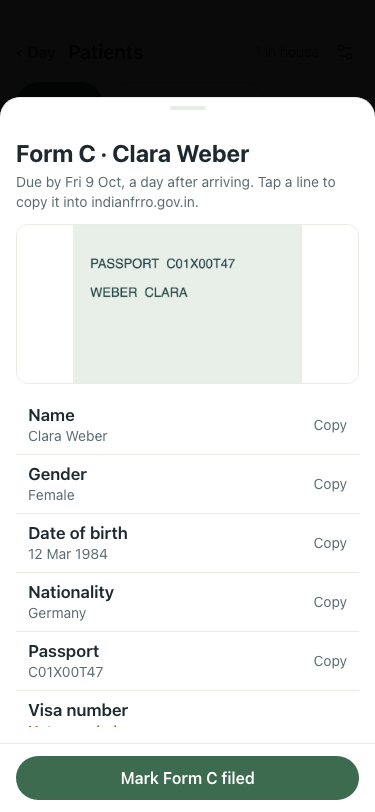

# UAT 2026-10-08-510-after

Base http://localhost:8151, 375x812. Written by scripts/uat.mjs.

| # | Step | Result | Read off the page | Shot |
|---|---|---|---|---|
| 01 | The card offers a passport photo | pass | Passport photo · Take a photo |  |
| 02 | A photo is shrunk, kept, and shown on the Form C sheet | pass | kept 200, 25908 bytes, 1 picture on the sheet |  |
