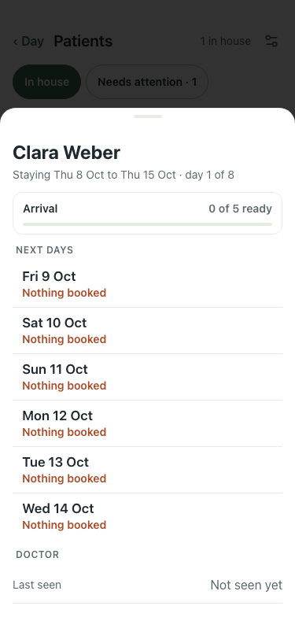

# UAT 2026-10-08-510-before

Base http://localhost:8140, 375x812. Written by scripts/uat.mjs.

| # | Step | Result | Read off the page | Shot |
|---|---|---|---|---|
| 01 | The card offers a passport photo | FAIL |  |  |
| 02 | A photo is shrunk, kept, and shown on the Form C sheet | FAIL | TimeoutError: locator.setInputFiles: Timeout 30000ms exceeded. Call log:   - waiting for locator('input[type=file]') |  |
