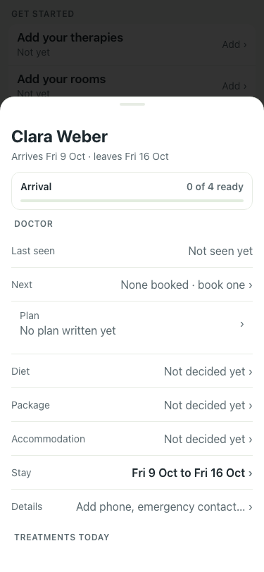
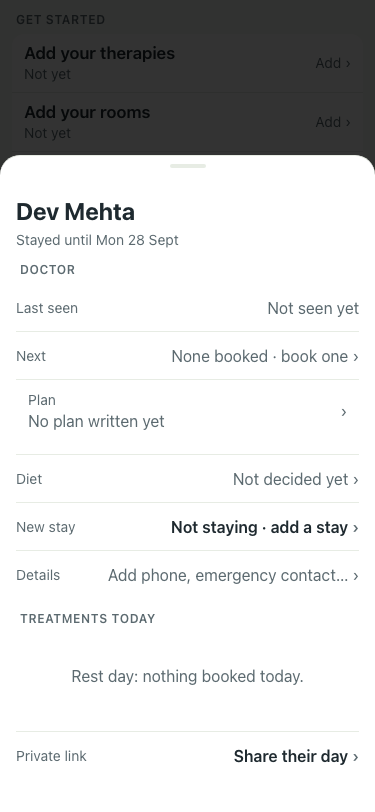
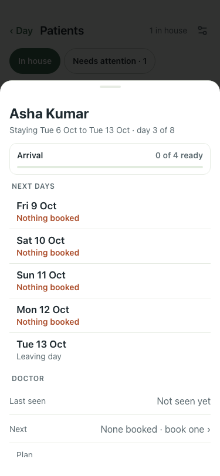

# UAT 2026-10-08-514-before

Base http://localhost:8140, 375x812. Written by scripts/uat.mjs.

| # | Step | Result | Read off the page | Shot |
|---|---|---|---|---|
| 01 | A guest arriving tomorrow: no "Rest day" | FAIL | Clara Weber · Arrives Fri 9 Oct · leaves Fri 16 Oct · Arrival |  |
| 02 | A guest who has left: no "Rest day" | FAIL | Dev Mehta · Stayed until Mon 28 Sept · DOCTOR |  |
| 03 | A guest who is here keeps "Rest day" on a free day | pass | TREATMENTS TODAY · Rest day: nothing booked today. |  |
