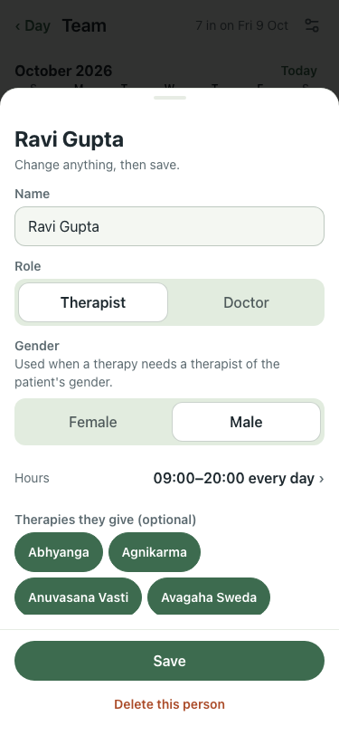

# UAT 2026-10-08-518-before

Base http://localhost:8140, 375x812. Written by scripts/uat.mjs.

| # | Step | Result | Read off the page | Shot |
|---|---|---|---|---|
| 01 | Another day: a person opens what changes that day | FAIL | Ravi Gupta · Change anything, then save. · Name · Role · Therapist · Doctor · Gender |  |
| 02 | In late moves what they miss that day | FAIL | TimeoutError: locator.click: Timeout 5000ms exceeded. Call log:   - waiting for getByRole('dialog').last().getByRole('button', { name: /^In late/ }) |  |
