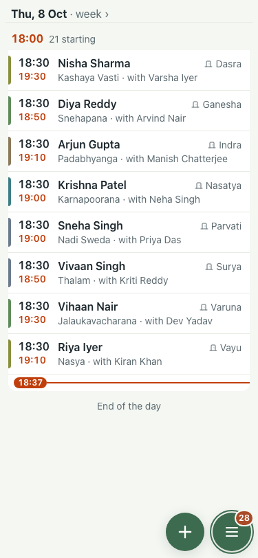
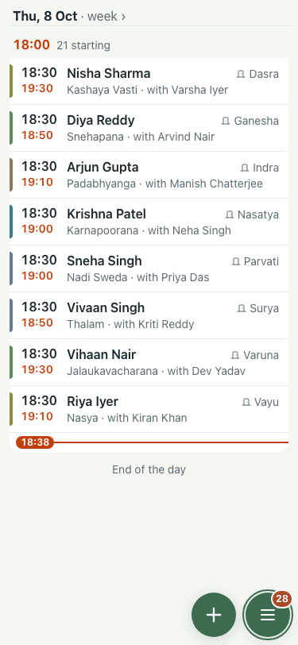
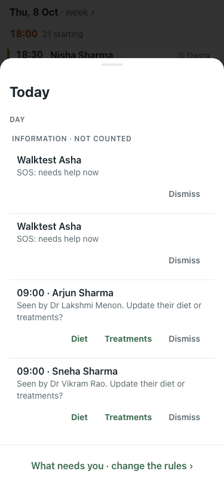

# UAT 2026-10-08-521-before

Base http://localhost:8080, 375x812. Written by scripts/uat.mjs.

| # | Step | Result | Read off the page | Shot |
|---|---|---|---|---|
| 01 | The count before the SOS | pass | 28 need you |  |
| 02 | An SOS raises the count by one | FAIL | 28 → 28 need you |  |
| 03 | The Today sheet shows it first, in red, outside Information | FAIL | Today · DAY · INFORMATION · NOT COUNTED · Walktest Asha · SOS: needs help now · Dismiss · Walktest Asha · SOS: needs help now |  |
