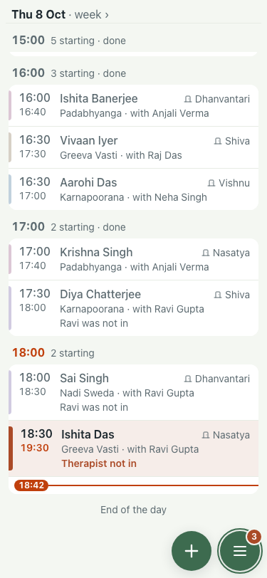
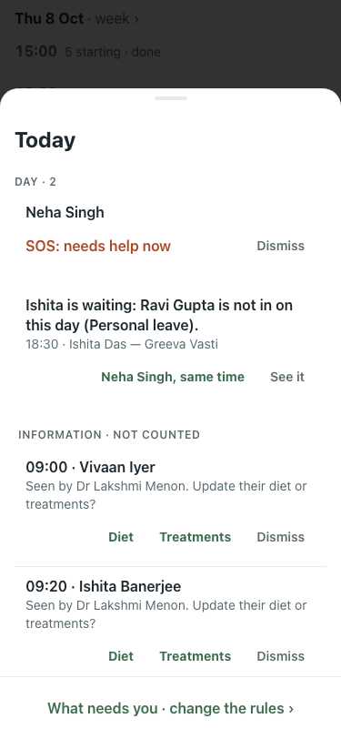

# UAT 2026-10-08-521

Base http://localhost:8141, 375x812. Written by scripts/uat.mjs.

| # | Step | Result | Read off the page | Shot |
|---|---|---|---|---|
| 01 | The count before the SOS | pass | 2 need you |  |
| 02 | An SOS raises the count by one | pass | 2 → 3 need you |  |
| 03 | The Today sheet shows it first, in red, outside Information | pass | Today · DAY · 2 · Neha Singh · SOS: needs help now · Dismiss · Ishita is waiting: Ravi Gupta is not in on this day (Personal leave). · 18:30 · Ishita Das — Greeva Vasti · Neha Singh, same time |  |
