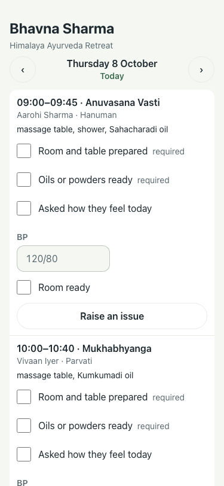
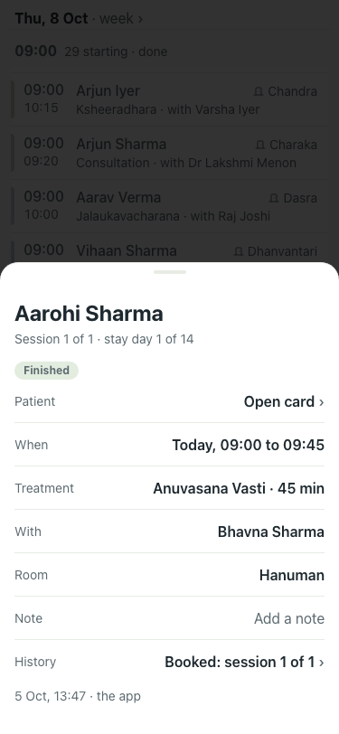

# UAT 2026-10-08-522-before

Base http://localhost:8080, 375x812. Written by scripts/uat.mjs.

| # | Step | Result | Read off the page | Shot |
|---|---|---|---|---|
| 01 | The therapist link has a Done tick first | FAIL | Thursday 8 October · Today · › · 09:00–09:45 · Anuvasana Vasti · Aarohi Sharma · Hanuman · massage table, shower, Sahacharadi oil · Room and table preparedrequired · Oils or powders readyrequired · Asked how they feel today |  |
| 02 | Ticking Done keeps the time | FAIL | TimeoutError: locator.check: Timeout 30000ms exceeded. Call log:   - waiting for getByLabel('Done').first() |  |
| 03 | The treatment card says Done, read only | FAIL | Room |  |
