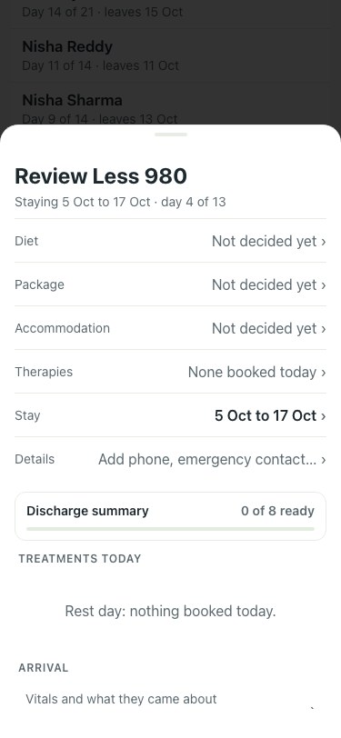

# UAT 2026-10-08-523-before

Base http://localhost:8080, 375x812. Written by scripts/uat.mjs.

| # | Step | Result | Read off the page | Shot |
|---|---|---|---|---|
| 01 | A patient with no review booked has Plan next week | FAIL | true · Review Less 980 · None booked today · None recorded · Next · None booked · book one |  |
| 02 | It repeats the week they had | FAIL | TimeoutError: locator.click: Timeout 5000ms exceeded. Call log:   - waiting for getByRole('dialog').last().getByRole('button', { name: 'Plan next week' }) |  |
| 03 | Book all books them, with one Undo | FAIL | TimeoutError: locator.click: Timeout 5000ms exceeded. Call log:   - waiting for getByRole('dialog').last().getByRole('button', { name: 'Plan next week' }) |  |
