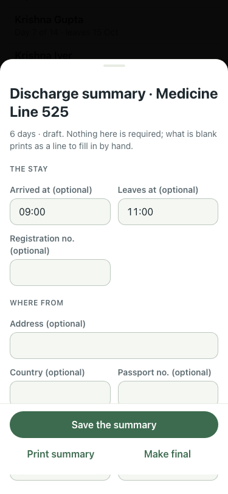

# UAT 2026-10-08-524-before

Base http://localhost:8080, 375x812. Written by scripts/uat.mjs.

| # | Step | Result | Read off the page | Shot |
|---|---|---|---|---|
| 01 | The discharge summary offers the card medication | FAIL | MEDICATION DURING THE STAY · Add a medicine · Add a medicine |  |
| 02 | One tap puts it in as the first medicine | FAIL | TimeoutError: locator.click: Timeout 5000ms exceeded. Call log:   - waiting for getByRole('dialog').last().getByRole('button', { name: /^Add from their card/ }) |  |
