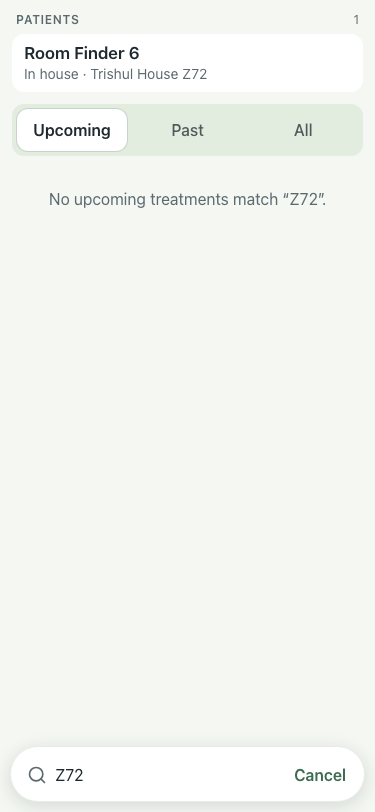
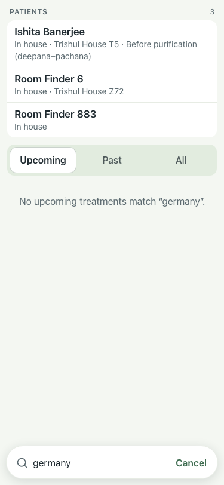

# UAT 2026-10-08-525

Base http://localhost:8146, 375x812. Written by scripts/uat.mjs.

| # | Step | Result | Read off the page | Shot |
|---|---|---|---|---|
| 01 | A guest room name finds who sleeps in it | pass | 1 · Room Finder 6 · In house · Trishul House Z72 · Upcoming · Past · All · No upcoming treatments match “Z72”. |  |
| 02 | A country finds the guest | pass | 3 · Ishita Banerjee · In house · Trishul House T5 · Before purification (deepana–pachana) · Room Finder 6 · In house · Trishul House Z72 · Room Finder 883 · In house |  |
