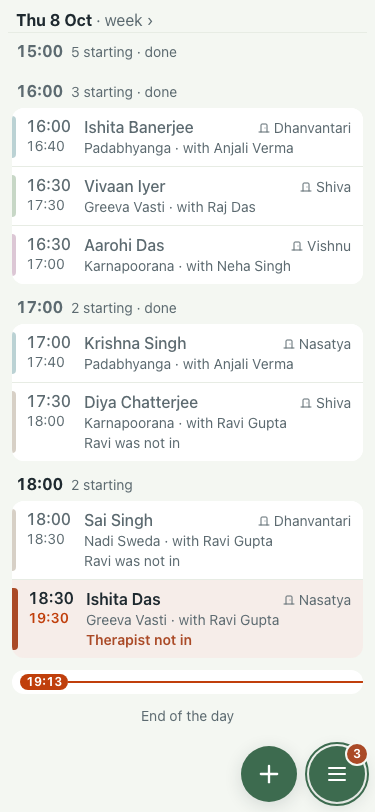

# UAT 2026-10-08-526-before

Base http://localhost:8140, 375x812. Written by scripts/uat.mjs.

| # | Step | Result | Read off the page | Shot |
|---|---|---|---|---|
| 01 | Settings reads the same count as the Menu | FAIL | Settings says 4, the Menu says 3 |  |
| 02 | A rule switched off says it is off | FAIL | What needs you ·  · 9 of 11 on. Only what needs action counts on the pill; information shows in grey. ·  · DAY · A therapist is not in, a room is out, or treatments clash · Counts on the pill · would raise 1 today · PATIENTS · Leaves today and has no discharge summary · Counts on the pill · nothing today · Arrival steps still open · Counts on the pill · would raise 1 today ·  · Raise it after 24 hours ⌄ |  |
