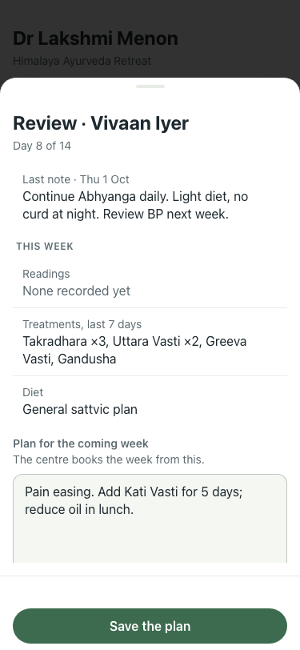

# UAT 2026-10-08-530

Base http://localhost:8152, 375x812. Written by scripts/uat.mjs.

| # | Step | Result | Read off the page | Shot |
|---|---|---|---|---|
| 01 | The review sheet shows this week: readings, treatments, diet | pass | Review · Vivaan Iyer · Day 8 of 14 · Last note · Thu 1 Oct · Continue Abhyanga daily. Light diet, no curd at night. Review BP next week. · THIS WEEK · Readings · None recorded yet · Treatments, last 7 days · Takradhara ×3, Uttara Vasti ×2, Greeva Vasti, Gandusha · Diet · General sattvic plan · Plan for the coming week |  |
