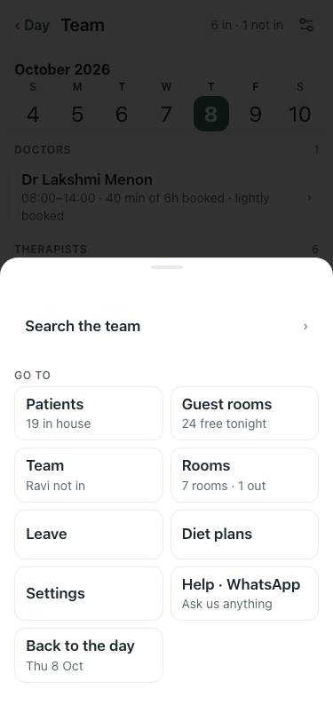
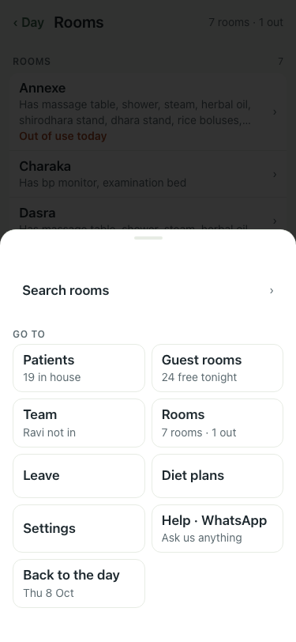
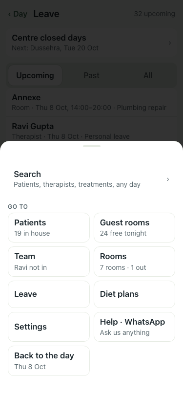
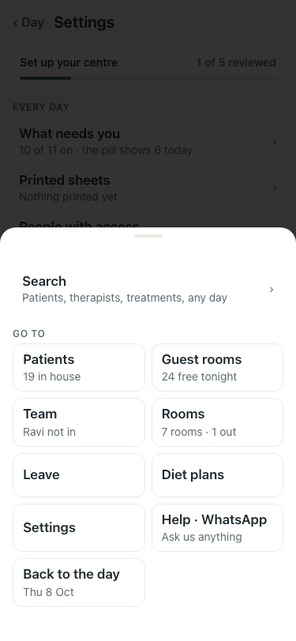

# UAT 2026-10-08-537-before

Base http://localhost:8140, 375x812. Written by scripts/uat.mjs.

| # | Step | Result | Read off the page | Shot |
|---|---|---|---|---|
| 01 | Team: the Menu says how many need you | FAIL | badge none; Menu · Search the team · › |  |
| 02 | Rooms: the Menu says how many need you | FAIL | badge none; Menu · Search rooms · › |  |
| 03 | Leave: the Menu says how many need you | FAIL | badge none; Menu · Search · Patients, therapists, treatments, any day |  |
| 04 | Settings: the Menu says how many need you | FAIL | badge none; Menu · Search · Patients, therapists, treatments, any day |  |
