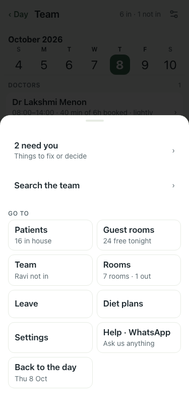
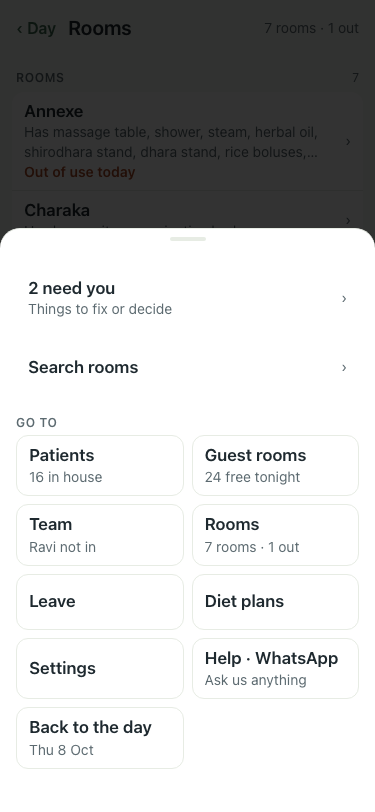
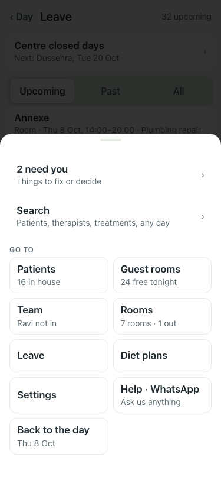
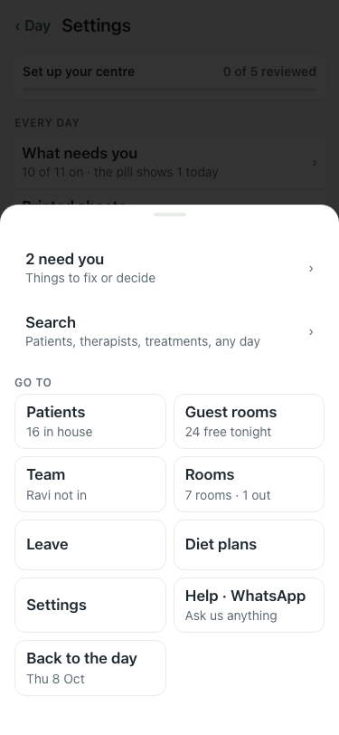

# UAT 2026-10-08-537

Base http://localhost:8151, 375x812. Written by scripts/uat.mjs.

| # | Step | Result | Read off the page | Shot |
|---|---|---|---|---|
| 01 | Team: the Menu says how many need you | pass | badge 2; Menu · 2 need you · Things to fix or decide |  |
| 02 | Rooms: the Menu says how many need you | pass | badge 2; Menu · 2 need you · Things to fix or decide |  |
| 03 | Leave: the Menu says how many need you | pass | badge 2; Menu · 2 need you · Things to fix or decide |  |
| 04 | Settings: the Menu says how many need you | pass | badge 2; Menu · 2 need you · Things to fix or decide |  |
