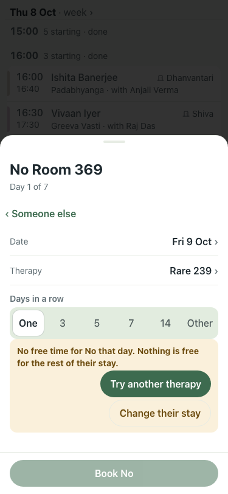

# UAT 2026-10-08-544-before

Base http://localhost:8140, 375x812. Written by scripts/uat.mjs.

| # | Step | Result | Read off the page | Shot |
|---|---|---|---|---|
| 01 | A therapy no room can host says why, with a way forward | FAIL | No free time for No that day. Nothing is free for the rest of their stay. · Try another therapy |  |
| 02 | The offer opens the room sheet with it ticked | FAIL | TimeoutError: locator.click: Timeout 5000ms exceeded. Call log:   - waiting for getByRole('dialog').last().getByRole('button', { name: /Add a room that has them/ }) |  |
