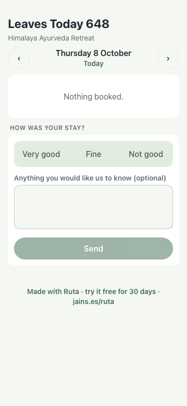
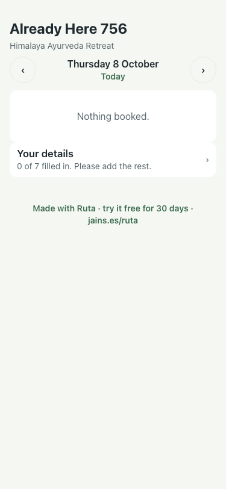
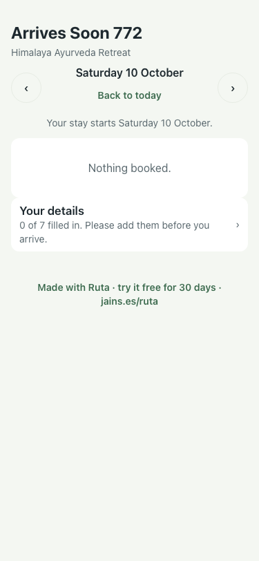

# UAT 2026-10-08-549

Base http://localhost:8156, 375x812. Written by scripts/uat.mjs.

| # | Step | Result | Read off the page | Shot |
|---|---|---|---|---|
| 01 | Leaving today: no details prompt, the question about the stay stays | pass | HOW WAS YOUR STAY? |  |
| 02 | Already here: it says add the rest, not before you arrive | pass | 0 of 7 filled in. Please add the rest. |  |
| 03 | Arriving later: it still says before you arrive | pass | Your stay starts Saturday 10 October. · 0 of 7 filled in. Please add them before you arrive. |  |
