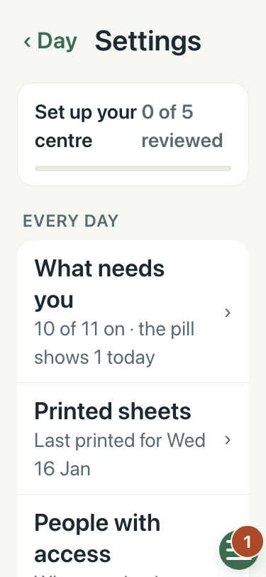
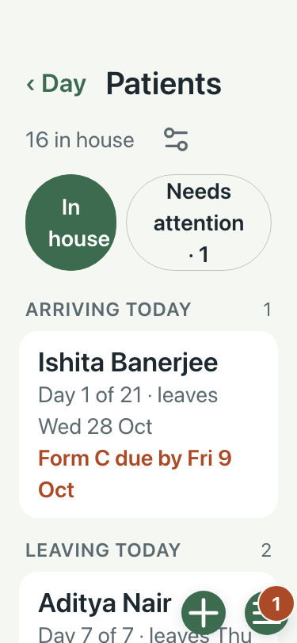
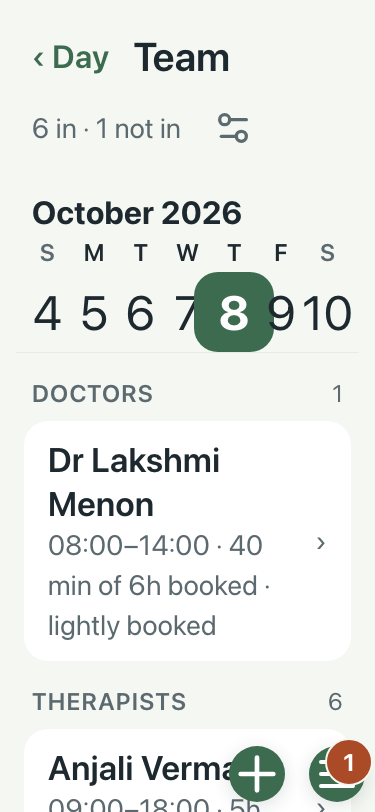
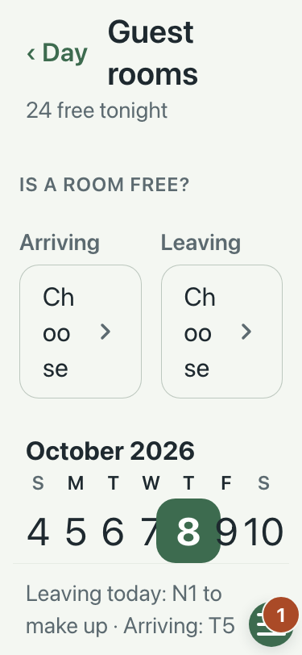
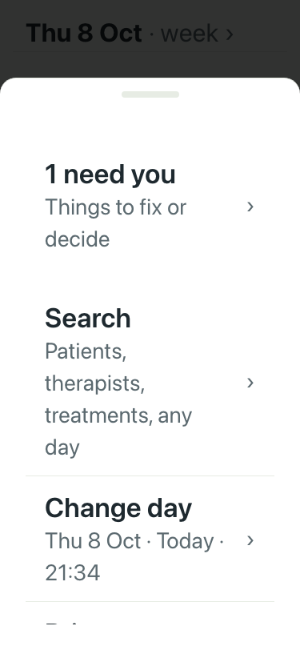

# UAT 2026-10-08-556

Base http://localhost:8159, 375x812. Written by scripts/uat.mjs.

| # | Step | Result | Read off the page | Shot |
|---|---|---|---|---|
| 01 | Settings at 200% text: nothing is cut | pass | nothing cut |  |
| 02 | Patients at 200% text: nothing is cut | pass | nothing cut |  |
| 03 | Team at 200% text: nothing is cut | pass | nothing cut |  |
| 04 | Guest rooms at 200% text: nothing is cut | pass | nothing cut |  |
| 05 | The Menu at 200% text: nothing is cut | pass | nothing cut |  |
