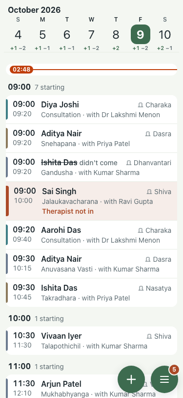

# UAT 2026-10-08-574

Base http://localhost:8151, 375x812. Written by scripts/uat.mjs.

| # | Step | Result | Read off the page | Shot |
|---|---|---|---|---|
| 01 | A switched-off person is refused on their next tap | pass | their session answered 200 while on, 401 once switched off |  |
| 02 | The phone of a switched-off person lands on the sign-in page | pass | signed in at /admin/schedule, after switch-off at /login |  |
