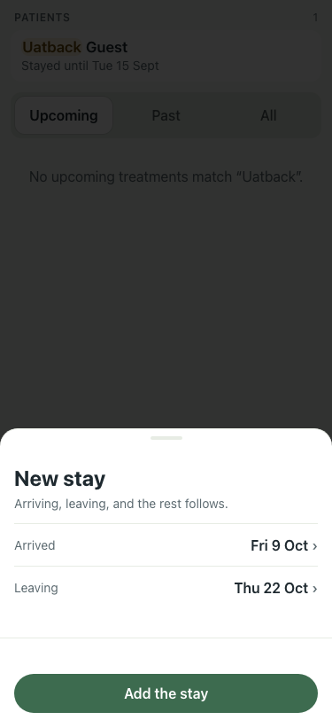
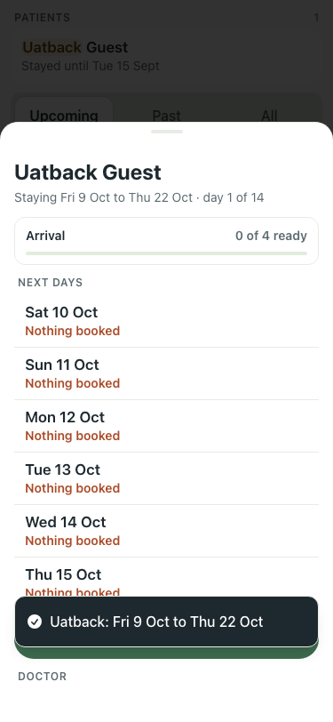
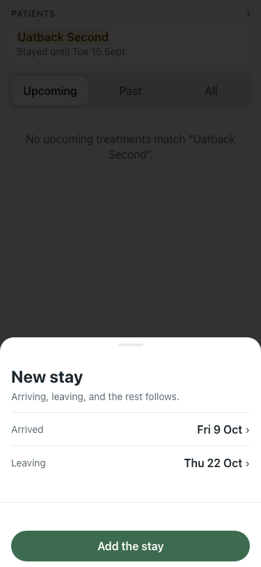

# UAT 2026-10-08-575-before

Base http://localhost:8140, 375x812. Written by scripts/uat.mjs.

| # | Step | Result | Read off the page | Shot |
|---|---|---|---|---|
| 01 | New stay for a past guest offers the first consultation | FAIL | New stay | Arriving, leaving, and the rest follows. | Arrived | Fri 9 Oct | › | Leaving | Thu 22 Oct | › | Add the stay | Close |  |
| 02 | Add the stay: the toast names the consultation and the card has it booked | FAIL | Uatback: Fri 9 Oct to Thu 22 Oct · Next None booked · book one |  |
| 03 | Later leaves the consultation to the card | FAIL | TimeoutError: locator.click: Timeout 5000ms exceeded. Call log:   - waiting for getByRole('dialog').last().getByRole('button', { name: 'Later', exact: true }) |  |
