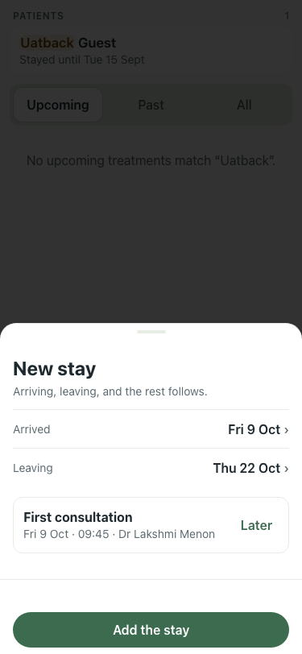
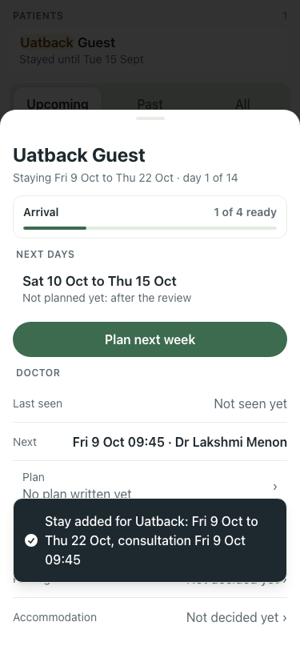
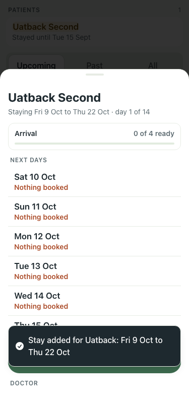

# UAT 2026-10-08-575

Base http://localhost:8152, 375x812. Written by scripts/uat.mjs.

| # | Step | Result | Read off the page | Shot |
|---|---|---|---|---|
| 01 | New stay for a past guest offers the first consultation | pass | New stay | Arriving, leaving, and the rest follows. | Arrived | Fri 9 Oct | › | Leaving | Thu 22 Oct | › | First consultation | Fri 9 Oct · 09:45 · Dr Lakshmi M |  |
| 02 | Add the stay: the toast names the consultation and the card has it booked | pass | Stay added for Uatback: Fri 9 Oct to Thu 22 Oct, consultation Fri 9 Oct 09:45 · Next Fri 9 Oct 09:45 · Dr Lakshmi Menon |  |
| 03 | Later leaves the consultation to the card | pass | sheet: New stay Arriving, leaving, and the rest follows. Arrived Fri 9 Oct › Leaving Thu 22 Oct › First con · card: Next None booked · book one |  |
