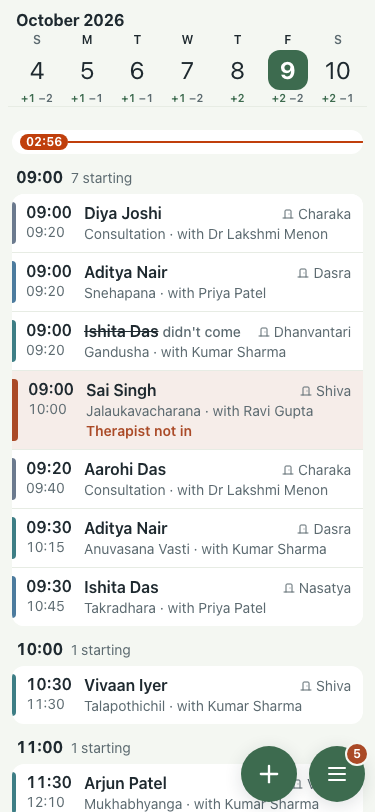
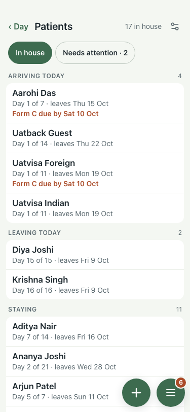
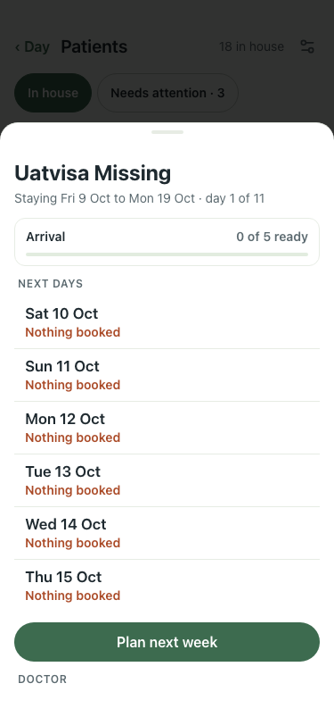

# UAT 2026-10-08-576-before

Base http://localhost:8140, 375x812. Written by scripts/uat.mjs.

| # | Step | Result | Read off the page | Shot |
|---|---|---|---|---|
| 01 | A foreign guest is asked for the visa; an Indian guest is not | FAIL | visa asked of the German guest: 0, of the Indian guest: 0 |  |
| 02 | The visa the guest types is on their Form C | FAIL | TimeoutError: locator.fill: Timeout 30000ms exceeded. Call log:   - waiting for getByRole('dialog').last().getByLabel('Visa number') |  |
| 03 | The card says how many Form C lines are missing | FAIL | Form C Due by Sat 10 Oct |  |
