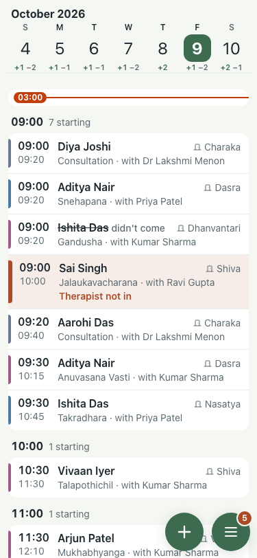
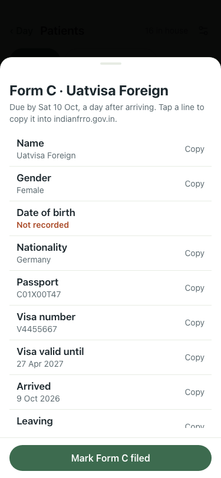
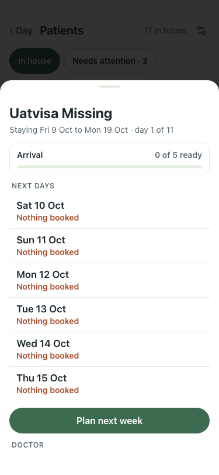

# UAT 2026-10-08-576

Base http://localhost:8153, 375x812. Written by scripts/uat.mjs.

| # | Step | Result | Read off the page | Shot |
|---|---|---|---|---|
| 01 | A foreign guest is asked for the visa; an Indian guest is not | pass | visa asked of the German guest: 1, of the Indian guest: 0 |  |
| 02 | The visa the guest types is on their Form C | pass | Form C Due by Sat 10 Oct · 3 missing · sheet: Visa number V4455667 Copy Visa valid until 27 Apr 2027 Copy Arrived |  |
| 03 | The card says how many Form C lines are missing | pass | Form C Due by Sat 10 Oct · 6 missing |  |
