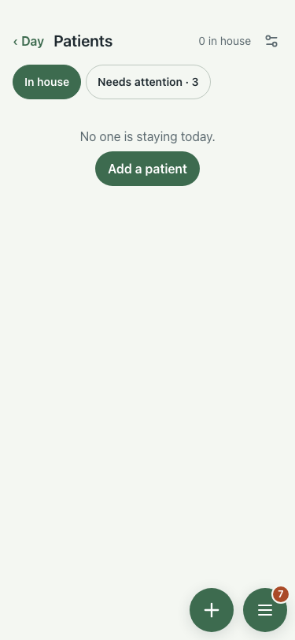

# UAT 2026-10-08-578-before

Base http://localhost:8140, 375x812. Written by scripts/uat.mjs.

| # | Step | Result | Read off the page | Shot |
|---|---|---|---|---|
| 01 | A refused call (429) says why, in one banner | FAIL | 0 banner:  |  |
