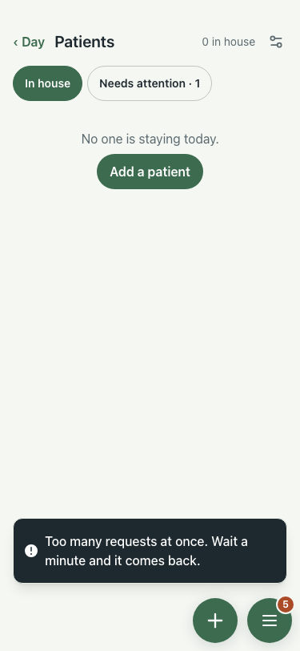

# UAT 2026-10-08-578

Base http://localhost:8154, 375x812. Written by scripts/uat.mjs.

| # | Step | Result | Read off the page | Shot |
|---|---|---|---|---|
| 01 | A refused call (429) says why, in one banner | pass | 1 banner: Too many requests at once. Wait a minute and it comes back. |  |
