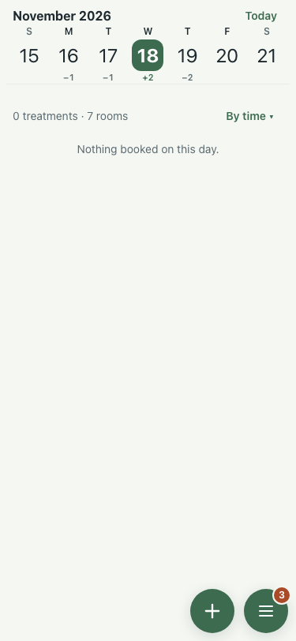
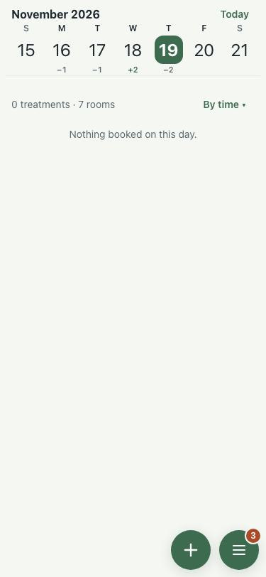
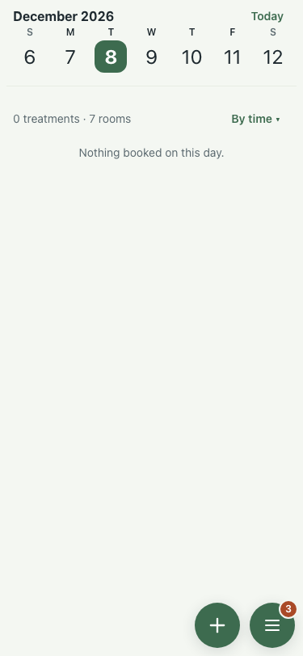

# UAT 2026-10-08-583-before

Base http://localhost:8140, 375x812. Written by scripts/uat.mjs.

| # | Step | Result | Read off the page | Shot |
|---|---|---|---|---|
| 01 | The arrival day names who arrives | FAIL | no line · other empty line |  |
| 02 | The leaving day names who leaves | FAIL | no line |  |
| 03 | A day with nobody coming or going still says nothing is booked | pass | Nothing booked on this day. |  |
