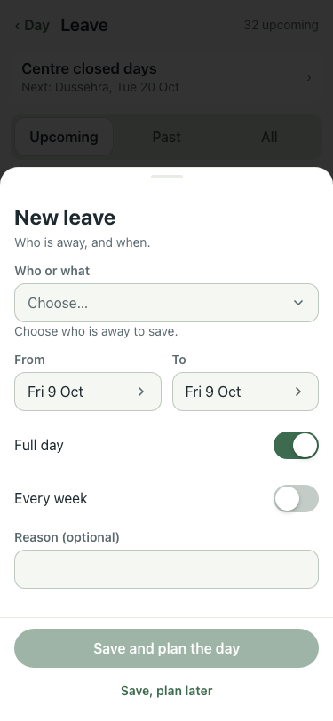
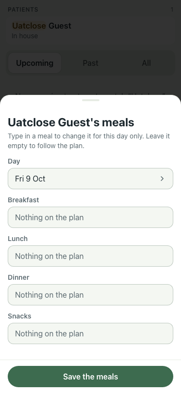

# UAT 2026-10-08-586-before

Base http://localhost:8140, 375x812. Written by scripts/uat.mjs.

| # | Step | Result | Read off the page | Shot |
|---|---|---|---|---|
| 01 | A new leave starts on tomorrow, after closing (21:30) | FAIL | From reads Fri 9 Oct, expected Sat 10 Oct |  |
| 02 | One day's meals open on tomorrow, after closing (21:30) | FAIL | Day reads Fri 9 Oct, expected Sat 10 Oct |  |
| 03 | A new leave starts on today, before closing (10:00) | pass | From reads Fri 9 Oct, expected Fri 9 Oct |  |
| 04 | One day's meals open on today, before closing (10:00) | pass | Day reads Fri 9 Oct, expected Fri 9 Oct |  |
