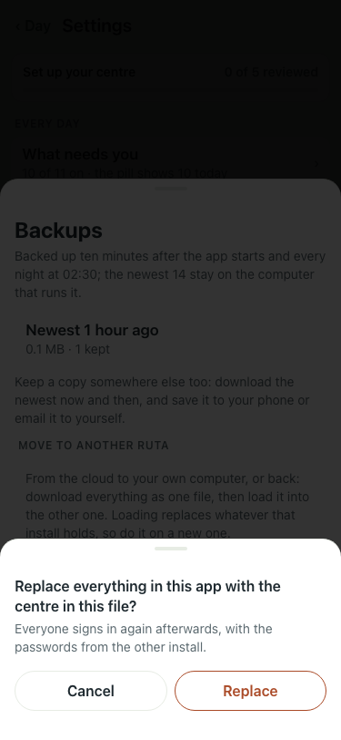
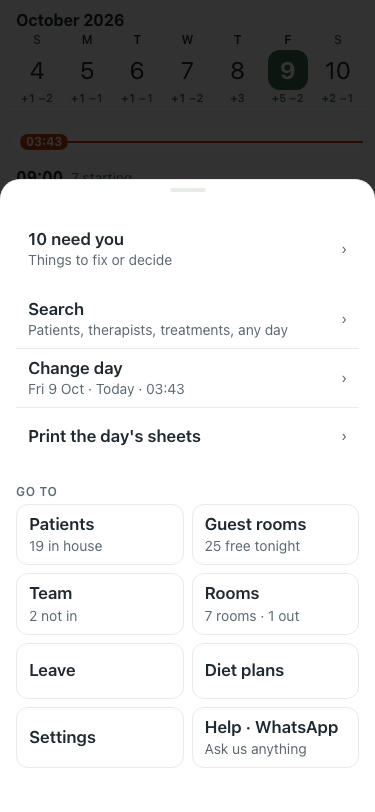

# UAT 2026-10-08-590-before

Base http://localhost:8140, 375x812. Written by scripts/uat.mjs.

| # | Step | Result | Read off the page | Shot |
|---|---|---|---|---|
| 01 | The confirmation sheet is named "Please confirm" | FAIL | TimeoutError: locator.click: Timeout 5000ms exceeded. Call log:   - waiting for getByRole('dialog', { name: 'Please confirm' }).getByRole('button', { name: 'Cancel' }) |  |
| 02 | The Menu sheet is still named "Menu" | pass | dialogs named "Menu": 1 |  |
