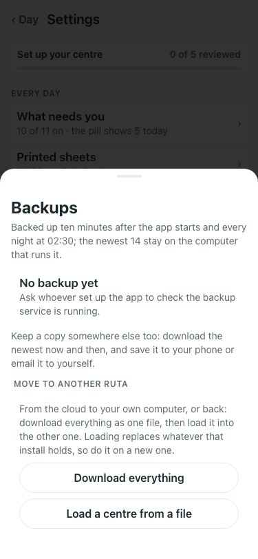
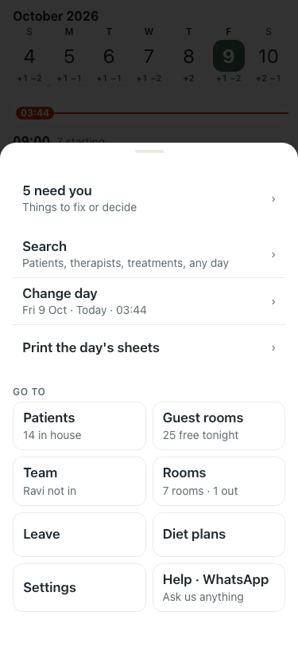

# UAT 2026-10-08-590

Base http://localhost:8158, 375x812. Written by scripts/uat.mjs.

| # | Step | Result | Read off the page | Shot |
|---|---|---|---|---|
| 01 | The confirmation sheet is named "Please confirm" | pass | dialogs named "Please confirm": 1, named "Menu": 0 · Please confirm | Replace everything in this app with the centre in this file? | Everyone s |  |
| 02 | The Menu sheet is still named "Menu" | pass | dialogs named "Menu": 1 |  |
