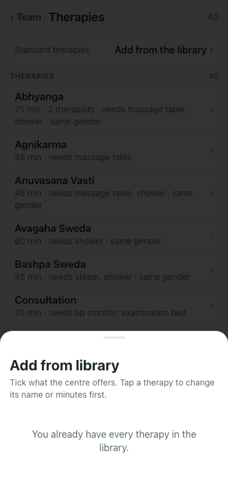

# UAT 2026-10-08-595-before

Base http://localhost:8140, 375x812. Written by scripts/uat.mjs.

| # | Step | Result | Read off the page | Shot |
|---|---|---|---|---|
| 01 | The library offers "Add one of your own" and it opens the Add therapy sheet | FAIL | TimeoutError: locator.click: Timeout 5000ms exceeded. Call log:   - waiting for getByRole('dialog').last().getByRole('button', { name: /Not on the list\? Add one of your own/ }) |  |
| 02 | A therapy of its own is added and listed | FAIL | TimeoutError: locator.click: Timeout 5000ms exceeded. Call log:   - waiting for getByRole('dialog').last().getByRole('button', { name: /Not on the list/ }) |  |
