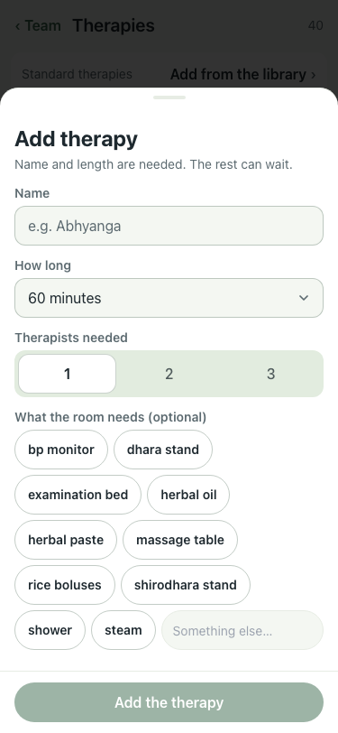
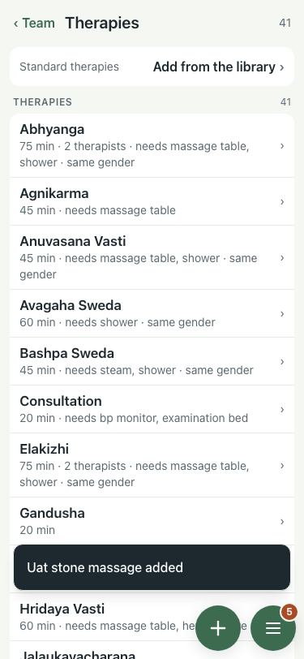

# UAT 2026-10-08-595

Base http://localhost:8159, 375x812. Written by scripts/uat.mjs.

| # | Step | Result | Read off the page | Shot |
|---|---|---|---|---|
| 01 | The library offers "Add one of your own" and it opens the Add therapy sheet | pass | line shown: 1, then: Add therapy | Name and length are needed. The rest can wait. | Name | How long | 15 minute |  |
| 02 | A therapy of its own is added and listed | pass | Uat stone massage added  |  |
