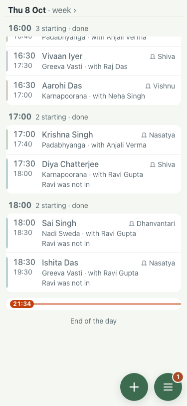
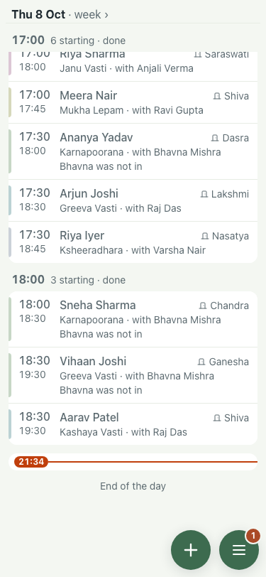

# Space under the day list, 8 Oct (375x812)

Scrolled to the bottom of the day. Before: main. After: this branch. (Different demo seeds, so different rows.)

| | Gap, "End of the day" to the buttons | Shot |
|---|---|---|
| Before | 82px |  |
| After | 52px |  |

`node scripts/uat-bottom-space.mjs` reproduces both.
