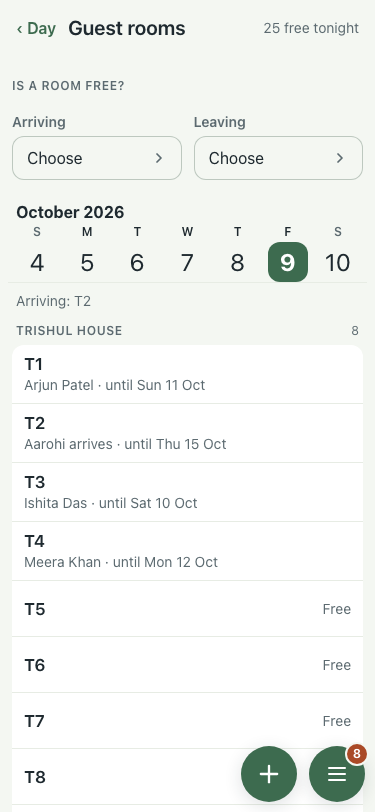
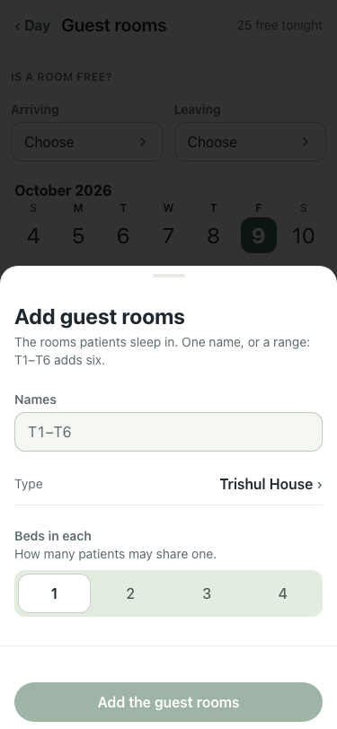
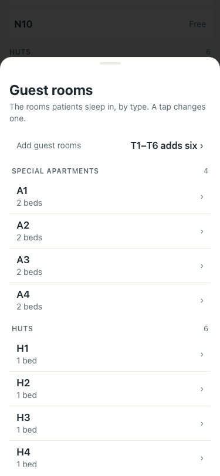
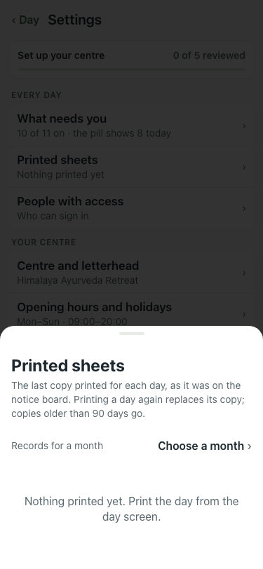

# Guest rooms, walked again on main after #560 and #561 (8 Oct)

Main stack on :8140 (lite seed), 375x812.

| # | Step | Result | Read off the page | Shot |
|---|---|---|---|---|
| 01 | Guest rooms screen, tonight | pass | ‹ Day | Guest rooms | 25 free tonight | IS A ROOM FREE? | Arriving | Choose | Leaving | Choose | October 2026 | S | 5 | M | 6 | T | 7 | W | 8 | T | 9 | F | 10 | S | 11 | S | 12 | M |  |
| 02 | + opens "Add guest rooms" | pass | Add guest rooms | The rooms patients sleep in. One name, or a range: T1–T6 adds six. | Names | Type | Trishul House | › | Trishul House | Nanda House | Huts | S |  |
| 03 | "Guest rooms · Names and beds" opens every room by type | pass | Guest rooms | The rooms patients sleep in, by type. A tap changes one. | Add guest rooms | T1–T6 adds six | › | SPECIAL APARTMENTS | 4 | A1 | 2 beds | › | A2 | 2 beds | › | A3 | 2 beds | › | A4 | 2 be |  |
| 04 | Settings → Printed sheets lists the sheets | pass | Printed sheets | The last copy printed for each day, as it was on the notice board. Printing a day again replaces its copy; copies older than 90 days go. | Reco |  |
