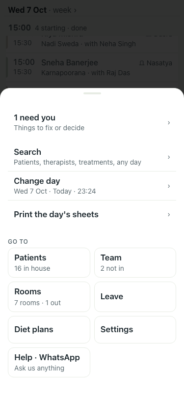
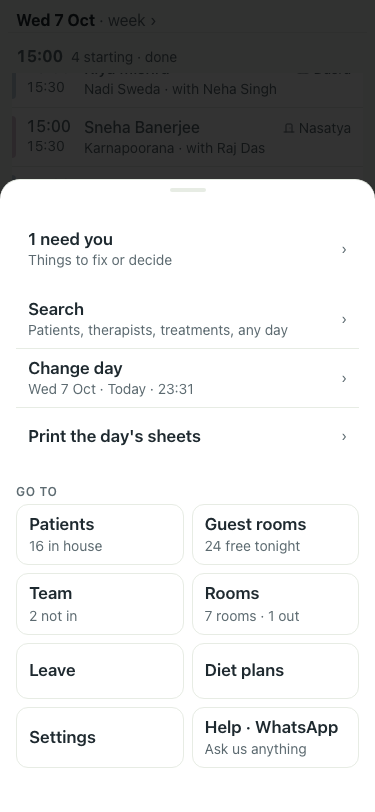
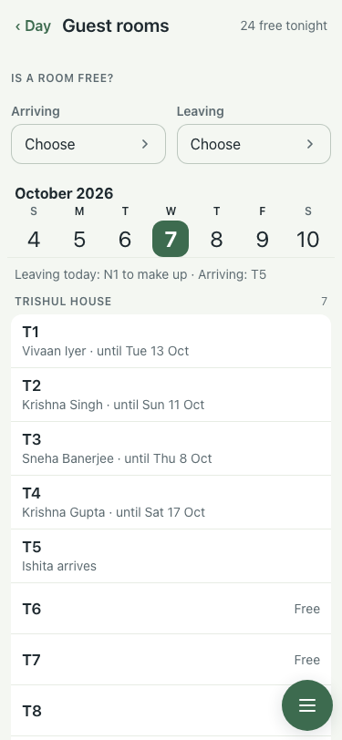
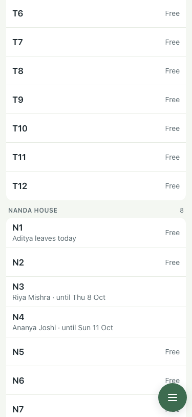
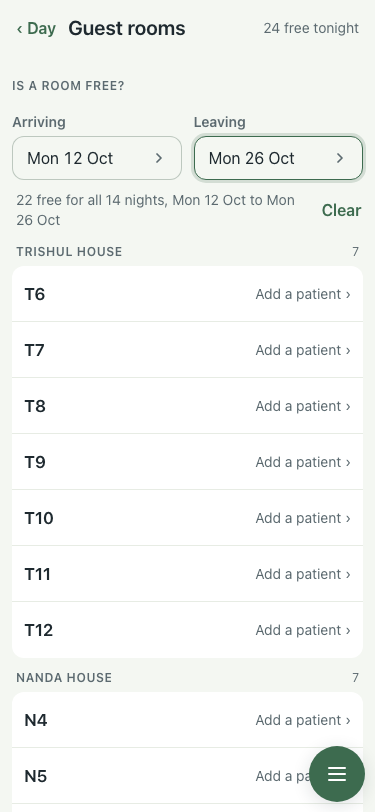
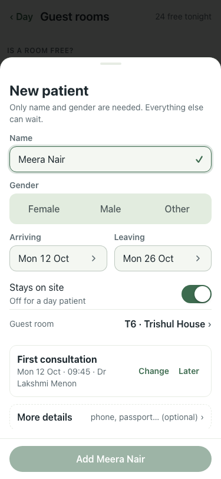

# #456 part 3: the Guest rooms screen (8 Oct)

| Step | What | Result | Shot |
|---|---|---|---|
| 1 | Menu before (:8201, main) | no guest rooms tile |  |
| 1 | Menu after (:8162) | "Guest rooms · 24 free tonight" tile |  |
| 2 | Guest rooms, tonight | Is a room free? at the top; week strip; "Leaving today: N1 to make up · Arriving: T5"; Trishul House rooms with who is in until when, who arrives, Free |  |
| 3 | Scrolled | N1 "Aditya leaves today · Free"; a two-bed room with one guest says "1 bed free" |  |
| 4 | Enquiry Mon 12 to Mon 26 Oct | "22 free for all 14 nights", by type, each "Add a patient ›" |  |
| 5 | Tap T6 | New patient with Mon 12 to Mon 26 Oct and Guest room T6 chosen |  |

qa on a fresh lite stack: 44 of 44. Smoke 6 of 6. Enquiry: 6 taps, no typing.
