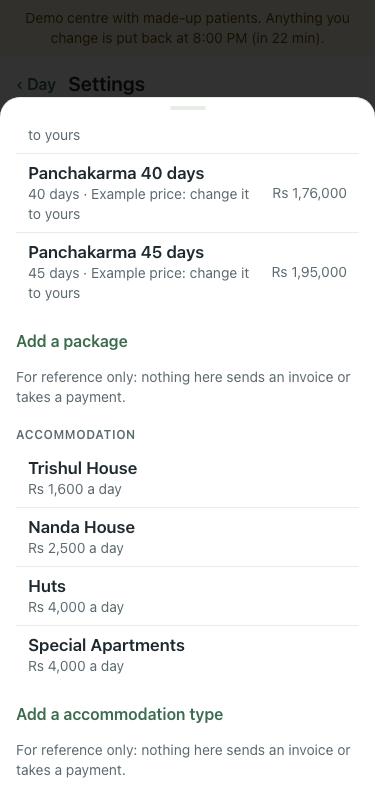
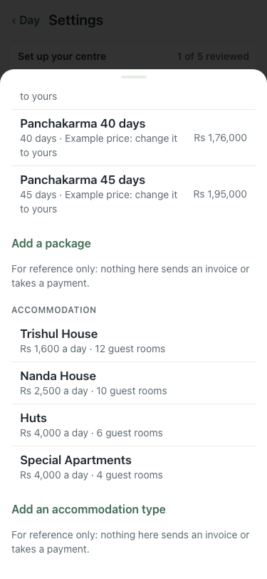
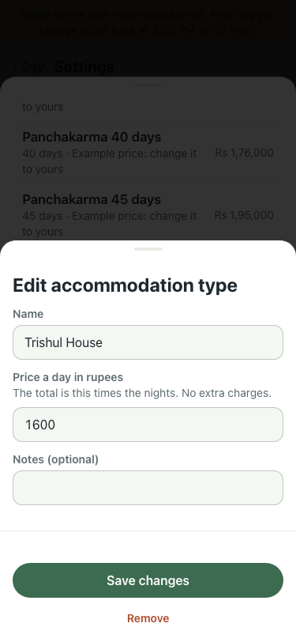
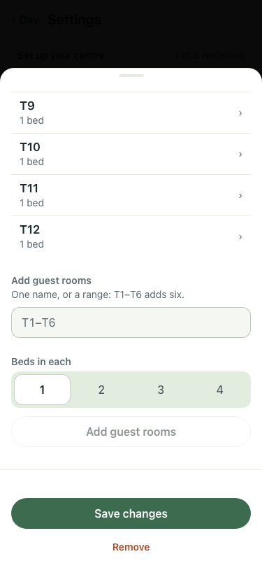
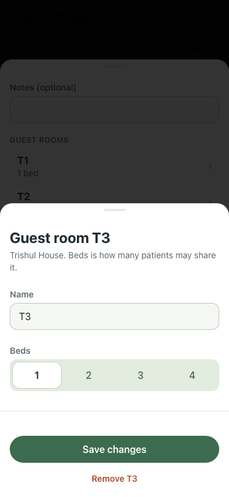

# #456 part 1: set up guest rooms (8 Oct)

| Step | What | Result | Before (:8201, main) | After (:8160, this branch) |
|---|---|---|---|---|
| 1 | Settings → Packages and accommodation | each type now says how many guest rooms it has; "Add an accommodation type" (was "a accommodation") |  |  |
| 2 | Tap Trishul House | its guest rooms T1–T12 listed, then "Add guest rooms" (one name or a range) with beds in each |  |  |
| 3 | Tap T3 | name, beds 1–4, Save changes, Remove T3 | — |  |

qa on a fresh lite stack: 42 of 42. Smoke 6 of 6.
