# #456 walk: guest rooms on a brand-new trial (8 Oct)

A fresh trial from a scratch provisioner (:8203, centre on :8395; :8202 was held by the parallel session's walk), main at #466, 375x812.

| Step | What | Result | Shot |
|---|---|---|---|
| 1 | Sign-up link, wizard (password, name, hours) | lands on Get started |  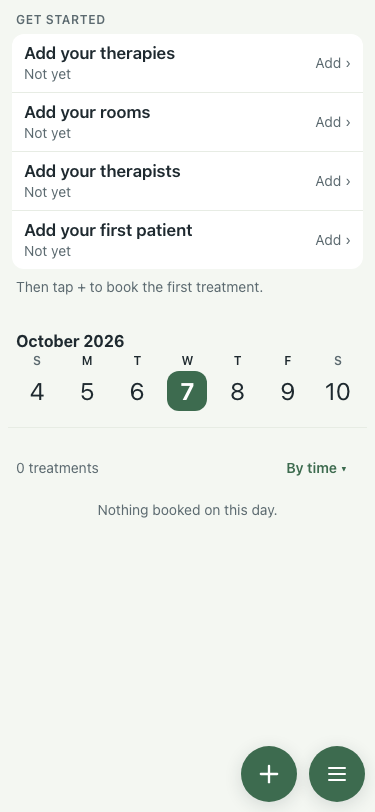 |
| 2 | Menu before any guest rooms | no Guest rooms tile: a centre without them sees no change | 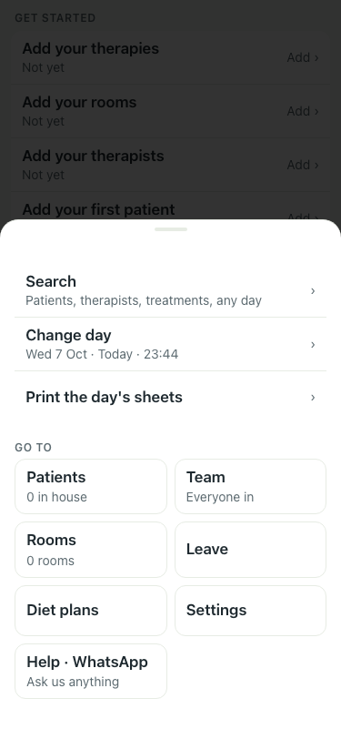 |
| 3 | Settings → Packages and accommodation → Trishul House, "T1–T4" | four rooms, 1 bed each | 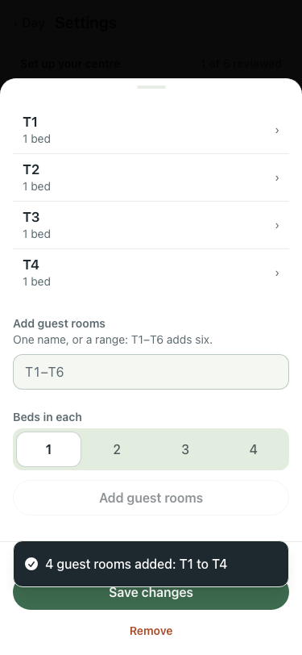 |
| 4 | Special Apartments, "A1-A2", beds 2 | two rooms, 2 beds each | 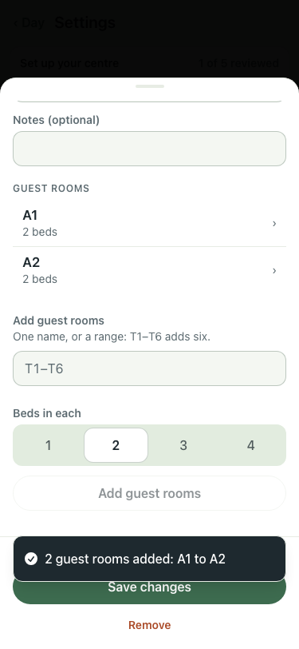 |
| 5 | New patient Asha Rao, today, a fortnight | Guest room T1 preselected | 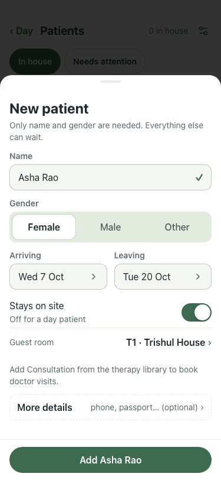 |
| 6 | New patient Vikram Shah | T2 preselected; T1 listed as taken by Asha | 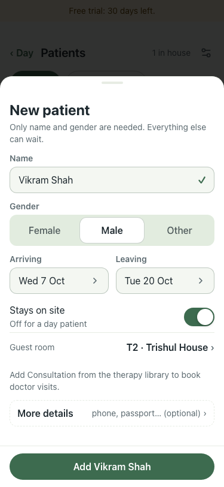 |
| 7 | The couple, Meera and Rohan Kapoor, a week, A1 | both saved into A1 (two beds) | 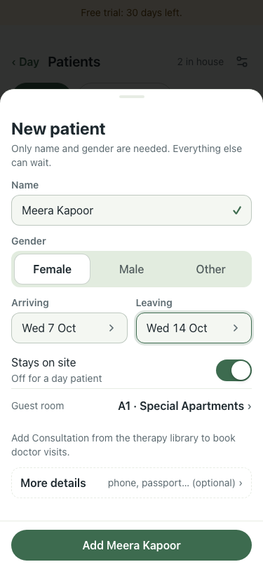 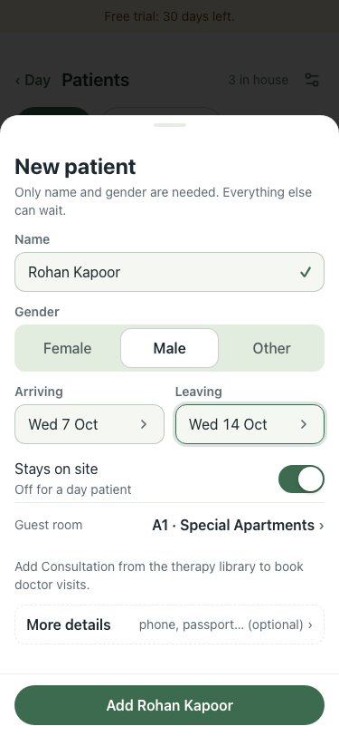 |
| 8 | Menu | "Guest rooms · 3 free tonight" | 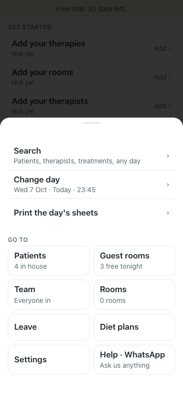 |
| 9 | Guest rooms tonight | "Arriving: T1, T2, A1"; T1 Asha, T2 Vikram, A1 Meera and Rohan; T3, T4, A2 Free | 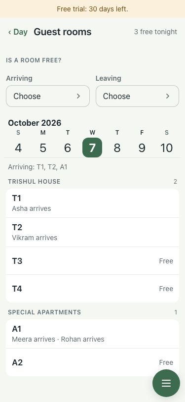 |
| 10 | Enquiry: Mon 12 to Mon 26 Oct | "3 free for all 14 nights": T3, T4, A2 | 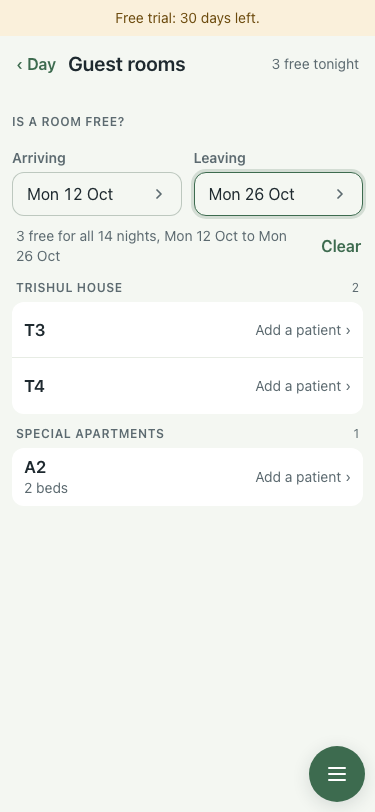 |
| 11 | Patient day sheet, printed | every name with its room (`w10-day-sheet.txt`) | `w10-day-sheet.pdf` |

Step 11 found one flaw: in a narrow name column the room wrapped away from the name ("Vikram Shah ·" / "T2"). Fixed in the follow-up PR: the room prints on its own line under the name.
