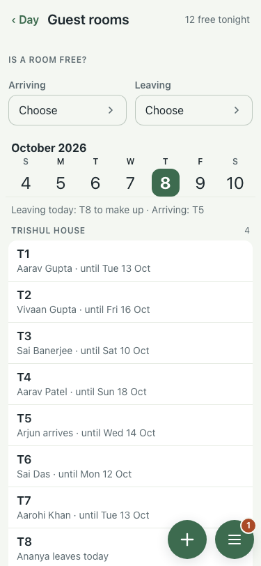
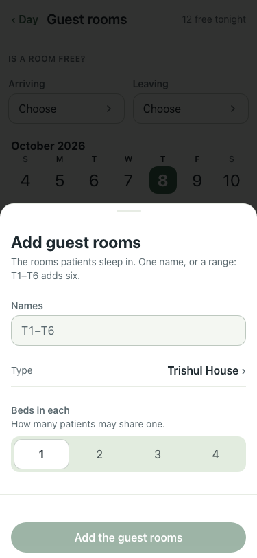
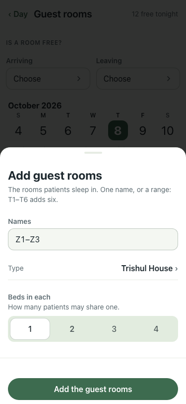
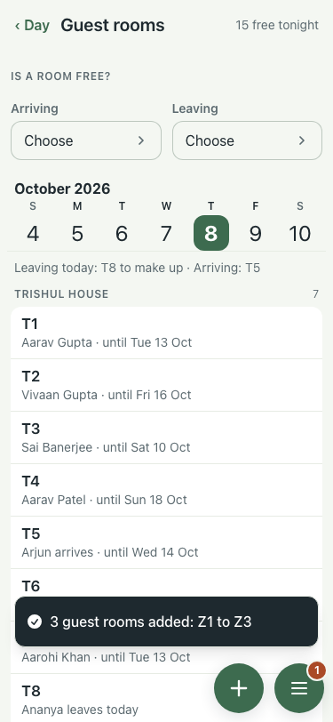
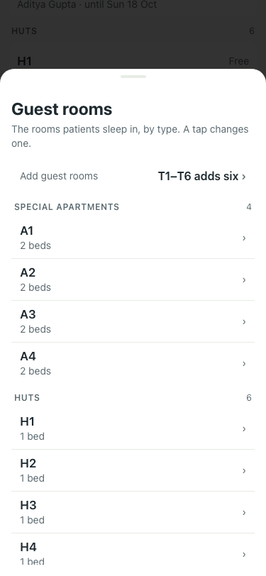
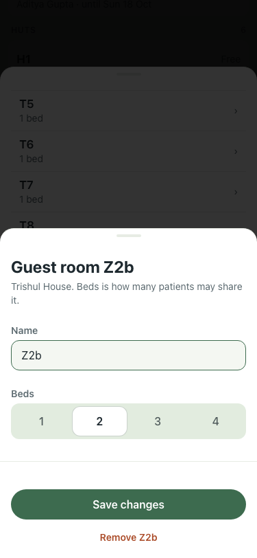
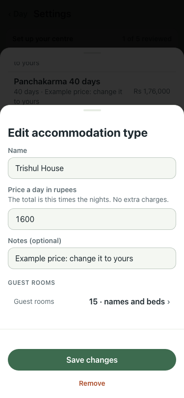
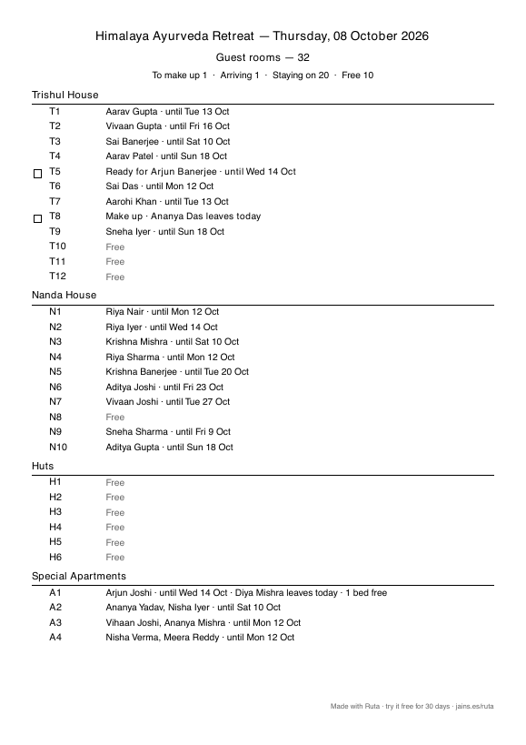

# #559 UAT, 8 Oct (demo seed)

Before: the Guest rooms screen had no way to add a room (the attached screenshot in the brief); rooms were added only under Settings → Packages and accommodation → a type.

| Step | Result | Shot |
|---|---|---|
| The screen has the + and a "Guest rooms · Names and beds" line | pass |  |
| + opens Add guest rooms | read |   |
| Z1–Z3 added with 2 beds | pass |  |
| The line lists every room by type | read |  |
| A tap changes a room | pass |  |
| Settings → a type has one Guest rooms line | pass |  |
| The guest rooms sheet | pass |  |
