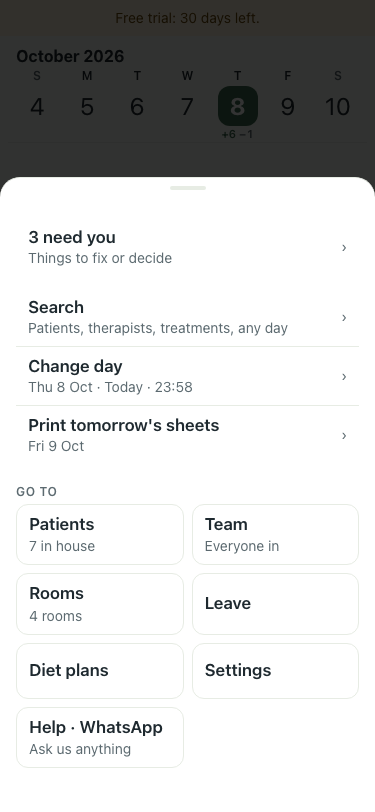
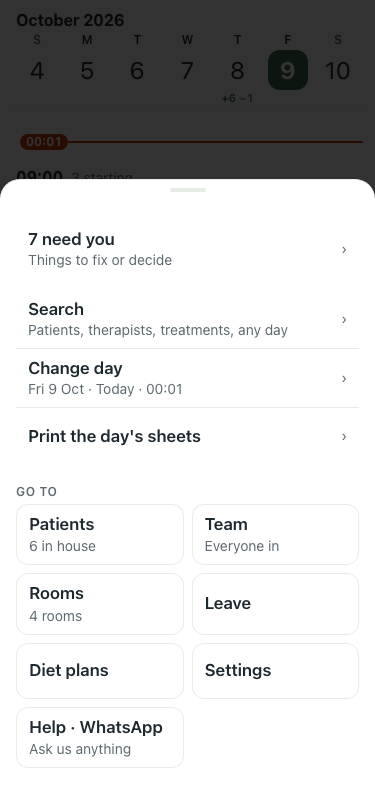
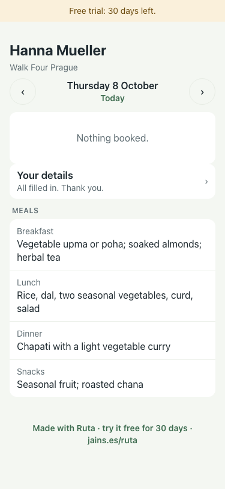
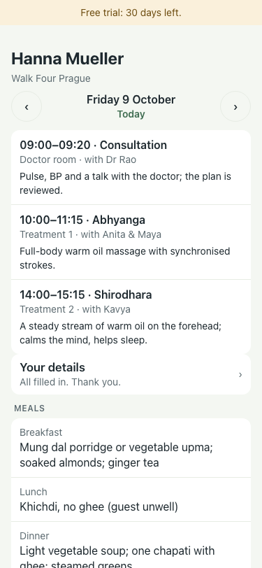
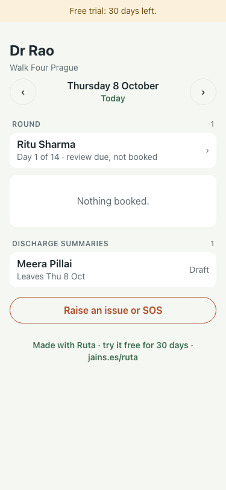
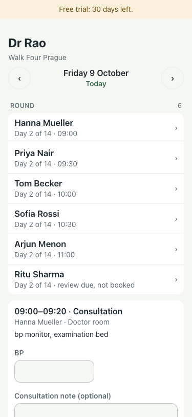

# The centre's midnight, Prague (8 to 9 Oct, 23:58 to 00:01 local = 21:58 to 22:01 UTC)

A trial centre built through the sign-up, timezone Europe/Prague, closing 19:00. Admin phone in Prague; the guest's link opened on phones set to Berlin and New York; the doctor's link on a Prague phone. Playwright `timezoneId` = each phone's zone, 375x812.

| What | 23:58, Thu 8 Oct | 00:01, Fri 9 Oct | Shots |
|---|---|---|---|
| The day | "Thu 8 Oct · Today · 23:58" | "Fri 9 Oct · Today · 00:01" |   |
| Print | "Print tomorrow's sheets · Fri 9 Oct"; the file is `ayurcalm-daily-schedule-2026-10-09.pdf` | "Print the day's sheets"; the same file, 2026-10-09 | |
| The count | "3 need you", 7 in house | "7 need you" (Friday's things), 6 in house (Meera left) | |
| A guest's private link (phone in Berlin, then New York) | "Thursday 8 October · Nothing booked" | "Friday 9 October", today's treatments (a New York phone, still on Thursday evening, shows the centre's Friday) |    |
| The doctor's link | "Thursday 8 October", Round: Ritu | "Friday 9 October", Round: 6 |   |

Result: pass. Every line follows the centre's clock, never the phone's. The New York centre (04:00 UTC) is walked in the next PR's note.
