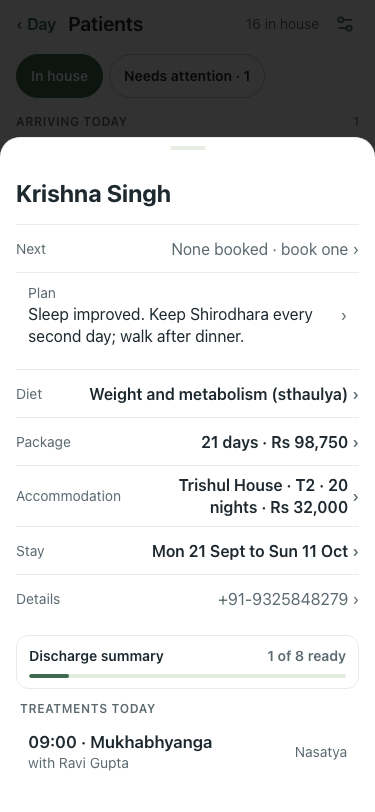
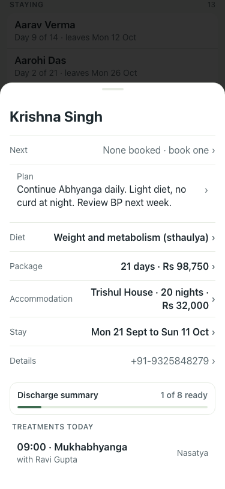
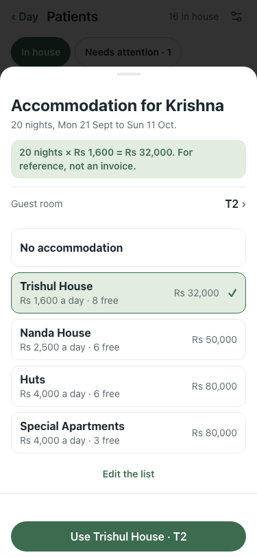
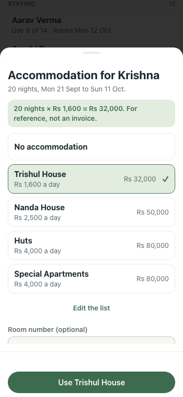
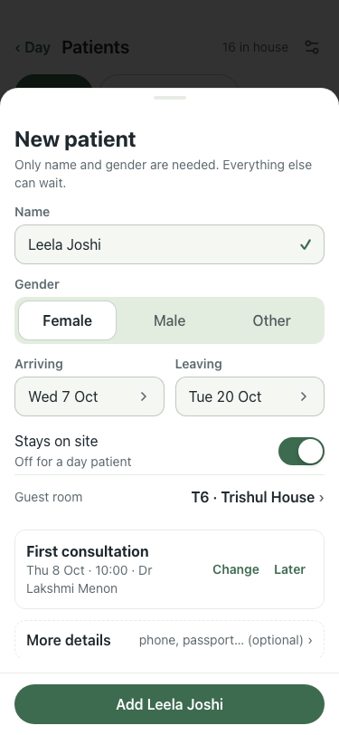
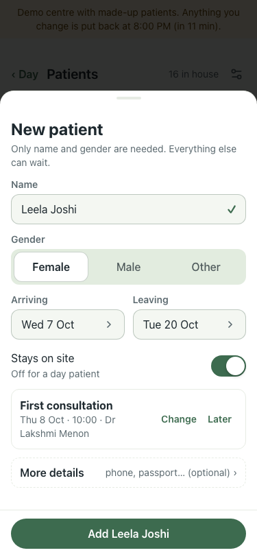

# #456 part 2: a guest room on every stay (8 Oct)

| Step | What | Before (:8201, main) | After (:8161, this branch) |
|---|---|---|---|
| 1 | A guest's card | "Trishul House · 20 nights" | "Trishul House · T2 · 20 nights"   |
| 2 | Card → Accommodation | free-text "Room number" | Guest room T2 preselected; each type says how many are free; taken rooms greyed with who and from when   |
| 3 | New patient, on site | no room | Guest room T6 · Trishul House preselected (first free for all nights)   |
| 4 | Patient day sheet, Thu 8 Oct | names only (`before-day-sheet.txt`) | room beside each name: "Vivaan Iyer · T1" (`after-day-sheet.txt`) |

qa on a fresh lite stack: 43 of 43. Smoke 6 of 6.
