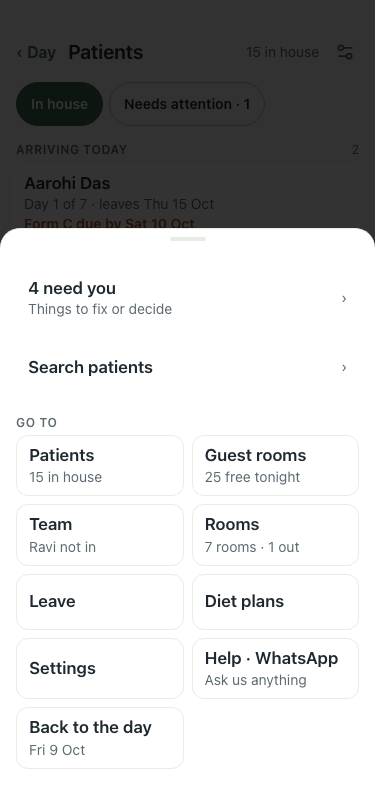

# UAT 2026-10-09-607-before

Base http://localhost:8140, 375x812. Written by scripts/uat.mjs.

| # | Step | Result | Read off the page | Shot |
|---|---|---|---|---|
| 01 | A day patient shows as "· N day" beside the in-house count, in Patients and in the Menu | FAIL | before 14 in house, 0 day; after 15, 0 · menu: 15 in house  |  |
