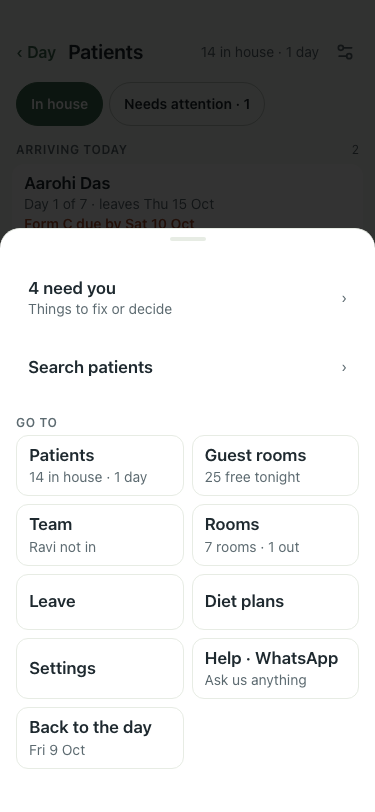

# UAT 2026-10-09-607

Base http://localhost:8162, 375x812. Written by scripts/uat.mjs.

| # | Step | Result | Read off the page | Shot |
|---|---|---|---|---|
| 01 | A day patient shows as "· N day" beside the in-house count, in Patients and in the Menu | pass | before 14 in house, 0 day; after 14, 1 · menu: 14 in house · 1 day  |  |
