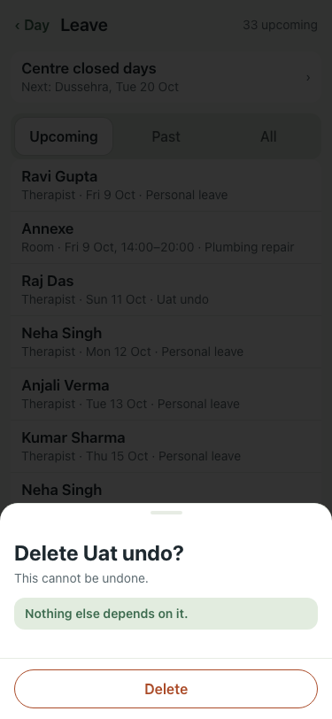

# UAT 2026-10-09-608-before

Base http://localhost:8140, 375x812. Written by scripts/uat.mjs.

| # | Step | Result | Read off the page | Shot |
|---|---|---|---|---|
| 01 | Delete this leave removes it with "Leave for … removed · Undo"; Undo brings it back | FAIL | TimeoutError: locator.click: Timeout 5000ms exceeded. Call log:   - waiting for locator('[data-sonner-toast]').getByRole('button', { name: 'Undo' }) |  |
